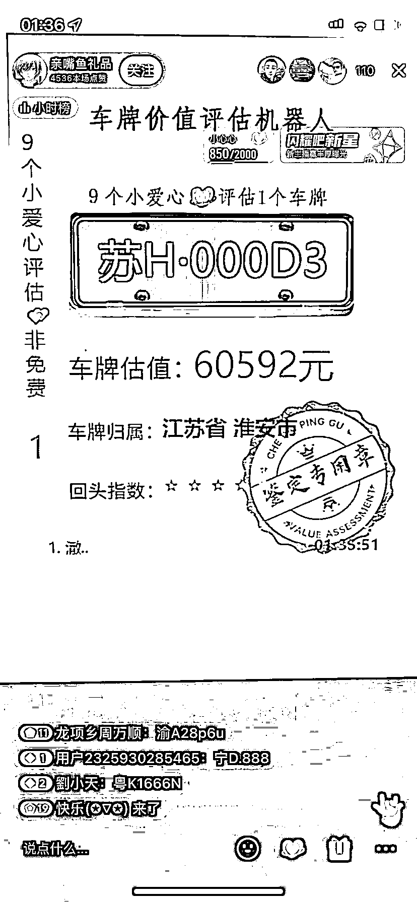

# 最近抖音很火的车牌估值项

> 原文：[`www.yuque.com/for_lazy/xkrm14/owo5o1hxfbmfpq7r`](https://www.yuque.com/for_lazy/xkrm14/owo5o1hxfbmfpq7r)

作者： 西哥

日期：2023-04-04

点赞数：48

正文：

分享一个最近抖音很火的车牌估值项目 关于这个项目的大体思路分享给大家，有兴趣的朋友可以研究看看 1.账号打造 可以弄一个古典的头像和名称，简介不要太繁琐，说清楚你是干什么的就好了，短期红利项目不用养号，老号把之前作品全隐藏了，直接播（等你养好号了，黄花菜都凉了），后面可以每天发一发直播间录屏视频，拉拉流量 2.开播流程 1、word 设置 打开在电脑上新建一个空白 word 软件，也可以插入一个背景图片，然后按照下面的格式把字敲上去，调成合适的大小、字体和颜色。 2、直播伴侣设置 打开直播伴侣，登陆抖音账号，开通直播权限，选择竖屏，点击添加素材，选择窗口调整窗口大小到只露出你打字的部位，插入你想插入的图片素材，点击开播 以上就是对这个项目玩法的拆解啦！希望看到这篇文章的朋友都能在 2023 年宏图大展、大赚特赚。 这边附上项目需要的一些文件资料 【超级会员 V5】通过百度网盘分享的文件：直播间背景图等 4 个文件 链接： 提取码：96w3 复制这段内容打开「百度网盘 APP 即可获取」[百度网盘+请输入提取码](https://pan.baidu.com/s/1ix3Gd1XTRqVO5Ruk9DzFAw?pwd=96w3)

  

评论区：

奶爸超人 : 好奇+攀比引发参与，刷礼物变现。

易从容 : emmmm

认知小窗-认哥 : 发了啥？

认知小窗-认哥 : 图二，最下方的澈，是人名嘛

员外 : 截图上门那个好像是自动的

公众号懒人找资源，懒人专属群分享

