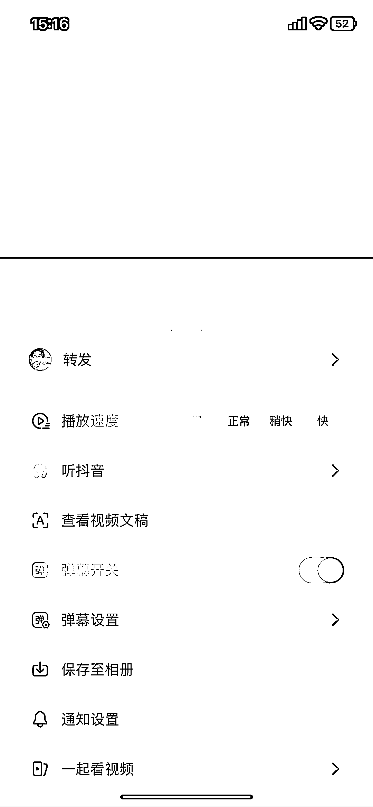

# 抖音新功能，长按视频有个查看视频文稿，可以把视频的文案复制出来

> 原文：[`www.yuque.com/for_lazy/xkrm14/yqb4hkx6p9fm3yef`](https://www.yuque.com/for_lazy/xkrm14/yqb4hkx6p9fm3yef)

作者： 行

日期：2023-04-03

点赞数：43

<ne-hole id="uc9bb7815" data-lake-id="uc9bb7815"><ne-card data-card-name="hr" data-card-type="block" id="YJxPP" data-event-boundary="card">

正文：

抖音起号 发现抖音新功能，长按视频有个查看视频文稿（图一），就能把视频的文案复制出来，再用 chatgpt 洗稿，一条原创带爆款属性的视频就很快出来了

<ne-card data-card-name="image" data-card-type="inline" id="tImw0" data-event-boundary="card"></ne-card>

<ne-card data-card-name="image" data-card-type="inline" id="XG9p9" data-event-boundary="card"></ne-card>

<ne-hole id="uce91d5da" data-lake-id="uce91d5da"><ne-card data-card-name="hr" data-card-type="block" id="I8C7n" data-event-boundary="card">

评论区：

知高 : chat gpt 发送什么让她洗稿呢

行 : 输入个要求（要求原文意思不变，语句通顺，通俗易懂，进行洗稿）

知高 : 谢谢🙏

正宇 : 可以可以！

<ne-hole id="ubfc93a3d" data-lake-id="ubfc93a3d"><ne-card data-card-name="hr" data-card-type="block" id="Q6OcJ" data-event-boundary="card">

公众号懒人找资源，懒人专属群分享

</ne-card></ne-hole></ne-card></ne-hole></ne-card></ne-hole>