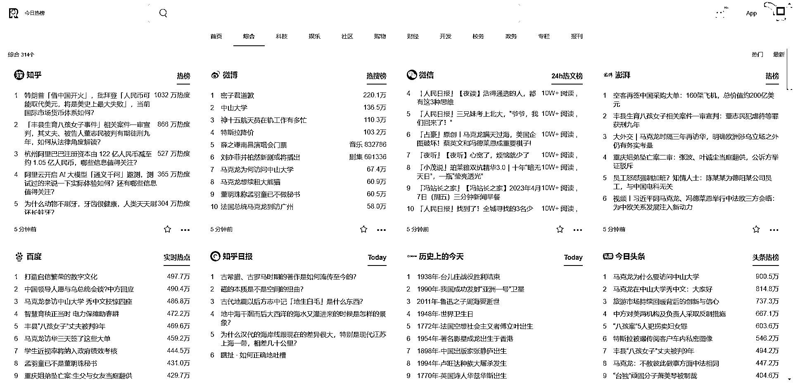

# 工具分享，今日热榜，寻找热点素材

> 原文：[`www.yuque.com/for_lazy/xkrm14/wgtyxxlmt75gl3pu`](https://www.yuque.com/for_lazy/xkrm14/wgtyxxlmt75gl3pu)

作者： 佳木

日期：2023-04-07

点赞数：112

<ne-hole id="uff4e0e8b" data-lake-id="uff4e0e8b"><ne-card data-card-name="hr" data-card-type="block" id="NQgvd" data-event-boundary="card">

正文：

分享一个网站，今日热榜，综合全网多个榜单，用来找寻一些热点素材可能有帮助 [今日热榜](https://tophub.today/c/news)

<ne-card data-card-name="image" data-card-type="inline" id="xEGd9" data-event-boundary="card"></ne-card>

<ne-hole id="u0543d27c" data-lake-id="u0543d27c"><ne-card data-card-name="hr" data-card-type="block" id="Q1jDQ" data-event-boundary="card">

评论区：

久违 : 你好，请问这个网站地址是多少可以发一下吗，谢谢[玫瑰]

若虚 : 直接百度“今日热榜”，第一个就是

时代 : tophub.today

温暖 : 我一直以为大家都知道这个网址😂😂😂😂

游世悟空 : 涛哥网感的那个帖子就说过，

蛋蛋。 : 以前用过一个抽屉新热榜，也是一些热点基层的 app，挺有意思的

<ne-hole id="ufbab9ca1" data-lake-id="ufbab9ca1"><ne-card data-card-name="hr" data-card-type="block" id="i5yZG" data-event-boundary="card">

公众号懒人找资源，懒人专属群分享

</ne-card></ne-hole></ne-card></ne-hole></ne-card></ne-hole>