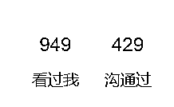

# 招聘人员，可以引流面试候选人到私域

> 原文：[`www.yuque.com/for_lazy/xkrm14/mzrqy6ub0vc6dc1h`](https://www.yuque.com/for_lazy/xkrm14/mzrqy6ub0vc6dc1h)

<ne-p id="u782ef6ea" data-lake-id="u782ef6ea"><ne-text id="u0bf3ad26">作者： 技术老 baby</ne-text></ne-p> <ne-p id="ue1ea988c" data-lake-id="ue1ea988c"><ne-text id="u2715855a">日期：2023-04-07</ne-text></ne-p> <ne-p id="u88ee0117" data-lake-id="u88ee0117"><ne-text id="u4db4f92d">点赞数：</ne-text><ne-text id="ufd037d53" ne-bold="true">72</ne-text></ne-p> <ne-hole id="u3d10c707" data-lake-id="u3d10c707"><ne-card data-card-name="hr" data-card-type="block" id="cmbqn" data-event-boundary="card"><ne-p id="u417eb815" data-lake-id="u417eb815"><ne-text id="ua90aa220">正文：</ne-text></ne-p> <ne-p id="u777d0243" data-lake-id="u777d0243"><ne-text id="u7086e519">最近找工作比较困难，岗位少人多，公司发布的岗位几天就上千人沟通，但是任何事情都可以两方面看，工作不好找说明公司好招人或者储备人，如果有心，完全可以在这阶段通过招聘渠道储备大量的专业人才到自己的私域作为自己的人才库，一个月搞满一个微信号不算困难，持续几个月可以搞满几个号，后续有很大的运营空间。</ne-text></ne-p> <ne-p id="u6145c25d" data-lake-id="u6145c25d"><ne-card data-card-name="image" data-card-type="inline" id="FRFq5" data-event-boundary="card">  <ne-hole id="u1b06bee5" data-lake-id="u1b06bee5"><ne-card data-card-name="hr" data-card-type="block" id="Xlf5g" data-event-boundary="card"><ne-p id="ufe864294" data-lake-id="ufe864294"><ne-text id="u2ce805f1">评论区：</ne-text></ne-p> <ne-p id="uf40aa030" data-lake-id="uf40aa030"><ne-text id="u1be07140">正宇 : 好思路</ne-text></ne-p> <ne-p id="u98348bec" data-lake-id="u98348bec"><ne-text id="u086b8772">爱米粒 : 思路清奇啊</ne-text></ne-p> <ne-p id="ub87cb822" data-lake-id="ub87cb822"><ne-text id="ua05cfb38">大龙 : 加一些打工人后续怎么变现呢</ne-text></ne-p> <ne-p id="u14e2ffab" data-lake-id="u14e2ffab"><ne-text id="ub6aab3f9">技术老 baby : 方式很多，比如副业，星球里这么多副业付费的圈子</ne-text></ne-p> <ne-hole id="ua8a5fcfa" data-lake-id="ua8a5fcfa"><ne-card data-card-name="hr" data-card-type="block" id="uaHEv" data-event-boundary="card"><ne-p id="u9e329d03" data-lake-id="u9e329d03"><ne-text id="uaad7f1d0">公众号懒人找资源，懒人专属群分享</ne-text></ne-p></ne-card></ne-hole></ne-card></ne-hole></ne-card></ne-p></ne-card></ne-hole>