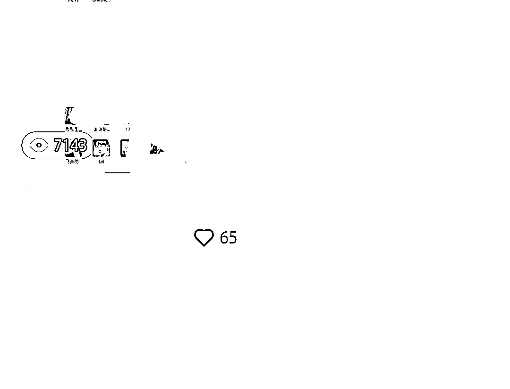

# 看完 80%以上的中标信息，引流了 300 多人到微信群

> 原文：[`www.yuque.com/for_lazy/xkrm14/lyrz7zal1uqcc6nw`](https://www.yuque.com/for_lazy/xkrm14/lyrz7zal1uqcc6nw)

作者： 明月几时有

日期：2023-04-07

点赞数：77

正文：

看完 80%以上的中标信息，引发的一些想法，从前天开始实战，一篇笔记，7000 加阅读量，已经引流了 300 多人到微信群，第一次体验被加暴微信的感觉。 [https://bfz1apob6p.feishu.cn/docx/CO0wdGpbOobwpOx0...](https://bfz1apob6p.feishu.cn/docx/CO0wdGpbOobwpOx0rdScgzYrn0e)

评论区：

明月几时有 : 想冲精华贴的，没有拿到好的结果，先把想法写出来，怕自己忘记

波叔 : 恭喜获得好成果[强]

钟莹 : 我也在做这个事[偷笑]跟您多学习

~ : [强]

Y。 : 龙岩学院？

明月几时有 : 是的，你呢

公众号懒人找资源，懒人专属群分享

