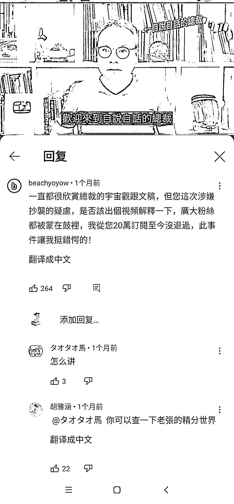
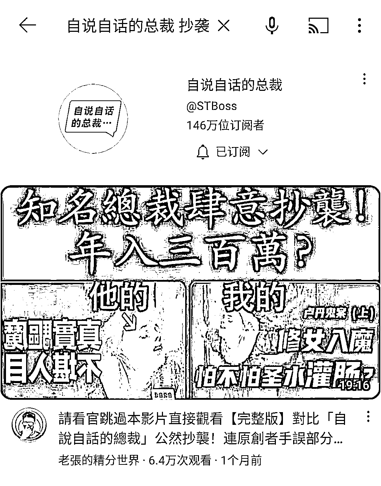

# 音乐可以做的项目

> 原文：[`www.yuque.com/for_lazy/xkrm14/sxk2y3ma70f5kf82`](https://www.yuque.com/for_lazy/xkrm14/sxk2y3ma70f5kf82)

作者： 书情小跟班

日期：2023-04-06

点赞数：107

正文：

失眠睡不着，于是在 YouTube 听放松的音乐🎵。 想来不止我一个人失眠，音乐作为少数能突破语言，突破国界的东西，可以说是人类共同的语言。 信息差，认知差，通过音乐有啥文章可做呢？我大概搜了搜生财原有的信息库做一个小小的总结，文末附上我查找的链接🔗 1、我国三亿人失眠，失眠是很多人都遇到的问题。把 YouTube 上助眠的音乐去卖，如下图就是我在 YouTube 上找的音乐，一个方案是从助眠音乐打包去拼多多卖。 2、用 AI 生成诗句，配上背景音乐，能引起好多跟帖共鸣，流量不错。这里的背景音乐到 YouTube 上找。 3、可以把图片变成轮播，碰上舒缓音乐的就是一个非常治愈的画面，把视频进行售卖，也可定制 将视频变为直播，配上白噪音也能解决情绪需求了 4、抖音直播间不间断播放“胎教音乐”，这类账号可以如何变现呢？ 以“免费领全套胎音乐”为诱饵，吸引粉丝进群，再设置钩子“加好友可进孕妈交流群/福利羊毛群”，并通过@强提醒引导粉丝加微信进入私域。 过程逻辑顺畅且操作简单，0 成本，0 门槛。每天引流 100+宝妈粉到微信，一个月多能卖 8000 箱。 5、发现一个利用文案金句赚钱的方法，一句好的文案配上一段解说加个背景音乐，就有很大的流量！ 6、以音为药，药治于心”。在小红书发治愈类音乐配对应视频，多为自然风景视频，评论区有不少求完整版的人。 7、短视频粒子音乐变现。这个粒子音乐，简单来说，就是歌词以文字跳动的方式组成，你也可以理解成字节跳动。 8、抖音无人直播助眠号/音乐号，不断优化直播素材，依靠知识付费，2 个月内变现 10w+的经验分享 搬运非常常规的项目了，毕竟国内大把人上不了外网，国外的好东西国内很多人都看不到，你帮他们看到，也是为他们提供了价值。 国外搬运国内，国内搬运国外，互相搬运来搬运去，抓住平台一波红红利赚个百来万也是常事，没啥觉得震惊，是非常平常的事。 这里给出亦仁的例子。 亦仁在研一的暑假了解到了一件事：YouTube 开放了他们的内容合作伙伴计划。 只要你能创作视频上传到 YouTube 上去，有访客观看该视频附带的广告，上传者就可以获得一部分广告分成。 于是他尝试性找了一些国内的小视频，以及根据热点自己创作的一些简单小视频上传上去并测试，发现可以盈利， 于是迅速投入更多的时间和资源。 当时伦敦奥运会男子 100 米决赛，YouTube 上没有直播，但全球很多人是通过 YouTube 了解奥运资讯。 于是在直播的结果出来的第一时间，他通过将文字转成语音并且配上几张新闻图做成了短资讯视频上传到了 YouTube，流量就迅速涌进来，丝毫不亚于 PaPi 酱当时发文后的阅读量上涨情况。 视频由原来的手工，到后面找懂技术的人合作，批量操作，自己赚到钱了，顺带带动班上的人一起做。 以下是亦仁的发帖原文 亦仁星主 2020/04/21 18:47 我是如何赚到第一个一百万 昨天聊了我大学期间赚到的第一个十万： 今天来，接着聊我赚到的第一个一百万，仍然在大学期间。 2012 年 4 月 12 号，Youtube Partner Program 面向 20 多个国家的视频创作者。 开放激励计划：你在 YouTube 上发布视频，视频中 YouTube 会插入广告，广告被浏览后会产生广告收入，YouTube 与创作者进行广告分成，大概 1000 次播放产生 5 美金（不同主题、不同主题的视频差别比较大）的分成。 而中国是这 20 个国家之一。 同样，2012 年，7 月份，我在读研究生，暑假，当时在纠结毕业后走什么路线，是变成一个专业人士呢，还是做自己喜欢的互联网，也很迷茫。 当时，我在网上有一个关系很好的朋友，我们两个人是在一个网络电话论坛（有机会介绍这段故事）认识的，我俩经常闲着没事瞎聊，一个偶然的机会，刷到了上面 YouTube Partner Program 面向中国开放的消息，比较敏锐，觉得是个赚钱的机会。 为什么会刷到呢？ 可能没事就喜欢在网上看看这些新的消息。 加上有赚到过钱的经历，对这些信息算很敏感。 刷到那条新闻，又觉得是个机会后，快速的去测试了下（当时执行力真的很强）。 我们就开始去注册 YouTube 账号，申 Adsense ，然后从国内搬运了一些视频过去，为了快速测试，也没管什么版权不版权，这一测试不要紧，随便搬的前 10 个视频，就产生了 5 美金的收入。 机会来了！ 还记得生财日历第一句话我怎么说的吗？ “有钱赚的时候，要集中所有的资源和精力， All in，不要小富即安。 过几年你会拍大腿，那么好的捡钱的机会，为什么错过了” 我就是从这段经历，得出的这个感触。 经过一些思想挣扎，我放弃了当时正在备考的注册会计师资格证，开始 All in 进 YouTube 赚钱这个机会。 从一个账户到几百个账户， 从一个主题到几百个主题， 从一个人到带着全班一起， 从搬运视频到自己找热点创作一些视频， 从手动传视频到几百台 VPS 到脚本自动化， 从每天几个小时到几乎全天。。。 印象最深的是，伦敦奥运会，全球热点，所有人都在关注，大流量，超级大流量。 但 Youtube 没有直播，所有人想看最新消息，得等专业视频机构做好视频传到 Youtube 上去，这个时候，谁第一时间，把视频传上去，就是上百万流量的机会，几千美金的收入，说时间就是钱，不为过。 但没办法在 Youtube 做直播，怎么办？ 办法总比困难多，只要你有强烈的赚钱欲望，困难一定是可以解决的。 记住这句话，只要你有强烈的赚钱欲望，所有的问题都不是问题。 我在国内，通过国内的视频网站守着奥运会直播，结果一出来，立马配上几张图片和语音合成。 生成几十个短视频，丢到 Youtube 上去，再做一些最基本的关键词，一传上去，再一刷新，播放就过千了，搜索流量疯狂涌进来。 回头看，那段时间，真的是捡钱的时候，一个火热视频赚几千美金太平常了。 就这样，差不多持续了两年时间，赚到了我人生中第一个一百万，比一百万还多点。 我们班上不少跟着我一起做 Youtube 的同学，毕业后就在南京买了房，没靠家里。 后来竞争者越来越多，加上我们不怎么注重视频质量，除了赚到了美金，没有什么沉淀（这句话有点欠揍）。 Youtube 的流量红利期结束，进入到了专业视频创作者的领域，我也因为毕业来到了阿里，没有继续做这个事情。 这个是我人生中第一个赚到一百万的项目。 读研期间，还做了另外一件事，做考研笔记生意，写软文引流到 QQ，卖我自己整理的原创笔记，送 VIP 群咨询服务。 后来装满了几个 500 人的 QQ 群，基本后来考上那个专业的同学，有差不多一半买过我的笔记。 最后，总结下我从这个一百万中学习到了什么： 1\. 想清楚自己要什么是最重要的。 不要太在乎别人的想法，我们那个还算不错学校的学生，放弃专业去做 Youtube 会被认为不务正业，但自己想清楚后，就不要太在乎别人的想法了。 2. 多多与别人分享，分享是个多轮博弈，你主动分享一次，别人回馈你一点，你再分享一点，别人再回馈一点，这样就进入一个正向循环。 如果你分享了，对方没有反馈，那么也没有什么必要难受，实际上你过滤掉了一个不值得深入交往的人，把时间节约了出来； 3. 找到机会后，尽快产品化、自动化、规模化、矩阵化、建立团队，这些都是你的杠杆，可以大大提高效率。 4. 随着 Youtube 项目的结束，我意识到要有自己的产品，不做没有积累的事情，长期打磨，慢慢优化，到一定临界点，产品会爆发出极大的能量。 但做产品得坐很长时间的冷板凳，这过程中，得有现金流的业务。 这背后又有一个 1000 万的故事。 5\. 得有自己的小圈子，大家可以深入交流。 这个赚钱机会应该是我个跟另外一个小伙伴，两个人琢磨出来的，那个人怎么认识的呢， 泡论坛的时候认识的，我们两个经常一起交流怎么打免费网络电话。 后来还找到一个朋友帮我们写了批量脚本，之后因为各自忙其他事情不再联系。 后来这个朋友加入了生财有术，再后来，他才知道，那个”亦仁大大“是他当年帮助写脚本的小伙子，两个人在微信上一顿唏嘘。 6. 保持足够多的信息输入量，特别是一手信息，信息越多，越有价值。有些人因为信息爆炸而退圈，这不正是他们应该留下来的原因才对？ 7\. 赚钱，得趁早。 除了亦仁的案例，我再分享李笑来的案例 2011 年 3 月初，我在 twitter 上第一次见到 Bitcoin 这个词之后，几乎天天被它吓到。 第一次看新闻标题的时候，说它在二月份刚刚超过 1 美元！结果那才几天啊，就已经一块五了……等我四月底把账号弄好开始动手的时候，已经 4 块多了…… 然后开始买买买，等我买完第一批 2100 个的时候，均价竟然是 6 美元…… 还在涨！然后，到了六月初，最高涨到 32 美元！这才捂到手里多久啊！才一个月多一点，收益竟然比 5 倍还多！ 到了 2011 年 4 月底，我开始买比特币的时候，野心不大，只动用了 1 万多美元，均价 6 美元，买了 2100 个。 2011 年的时候，我甚至在自己的博客的顶部加上了一条广告：“长期收购比特币”。 到了 2013 年，央视记者采访我的时候，人家问我有多少个比特币，我觉得没啥必要隐瞒，但也没必要说那么清楚，所以回答是：“六位数，第一位是 1……”没想到这样一问一答，有个“标签”也好，“帽子”也罢，就落到了我的头上——“比特币首富”。 说明：关于李笑来的案列原来来自他写的书《韭菜的自我修养》 从亦仁和李笑来的案例我们能看到什么共同点？ 亦仁是 2012 年抓住了 YouTube 平台的红利，而李笑来呢？则是从 2011 年 3 月初就已经开始知道了 Bitcoin。 这两个项目赚钱的指向都是指向了信息差。 如果不能访问 YouTube，那么又如何能抓住 YouTube 的红利？ 如果不能访问 Twitter，又怎么这么早知道 Bitcoin 呢？ 想想是不是这么回事？ 像今年的热点 ChatGPT，如果不能上网又怎么去注册账号？又怎么卖账号？卖课程？卖星球？卖小报童？ 不能上网如何在更早的时间知道 ChatGPT？ 可见以上种种皆是因为信息差，因为墙的存在，一步快，步步快。 怎么上网？不能公开说，不过如果你解决不了上网，恐怕你做搬运的资格都没有。 搬运洗稿是常见的，连大 V 都不可避免，如最近拥有 146 万订阅的自说自话的总裁被爆抄袭，洗稿。 最后附上我从生财有术收集的关于音乐同时涉及到这个帖子的有关链接🔗 [亦仁：在学校门口卖 U 盘，我赚到了人生的第一个 10 万](https://t.zsxq.com/VrZNbun) [抖音无人直播助眠号/音乐号，不断优化直播素材，依靠知识付费，2+个月内变现+10W的经验分享](https://t.zsxq.com/0cHToVCQT) [https://t.zsxq.com/0c4rotn8B](https://t.zsxq.com/0c4rotn8B) [https://t.zsxq.com/0cZfpi81i](https://t.zsxq.com/0cZfpi81i) [https://t.zsxq.com/0cO0aGbNz](https://t.zsxq.com/0cO0aGbNz) [https://t.zsxq.com/0cawCwIkW](https://t.zsxq.com/0cawCwIkW) [https://t.zsxq.com/0cCjyhRPt](https://t.zsxq.com/0cCjyhRPt) [https://t.zsxq.com/0cXw15Qyl](https://t.zsxq.com/0cXw15Qyl) [https://t.zsxq.com/0cae78Vwr](https://t.zsxq.com/0cae78Vwr) [https://t.zsxq.com/0cvG55jWN](https://t.zsxq.com/0cvG55jWN) [https://t.zsxq.com/0c3NSrskA](https://t.zsxq.com/0c3NSrskA) [全国婴儿奶粉批发，6+个月从+0-85+万利润](https://t.zsxq.com/0cBsEOWWl) [https://t.zsxq.com/0ciwo09Nw](https://t.zsxq.com/0ciwo09Nw) [https://t.zsxq.com/0csnaxcyF](https://t.zsxq.com/0csnaxcyF) [2+年发布+3000 视频成为+YouTube+法语区教育类的+TOP1+的复盘分享](https://t.zsxq.com/0cKGo9S7V) [https://t.zsxq.com/0cQgDN6VL](https://t.zsxq.com/0cQgDN6VL) [https://t.zsxq.com/0c164TRaU](https://t.zsxq.com/0c164TRaU) [https://t.zsxq.com/0c164TRaU](https://t.zsxq.com/0c164TRaU) [独家文字特效短视频：粒子音乐变现副业项目，实操复盘大解析分享给你！](https://t.zsxq.com/0cXwtye5U) [https://t.zsxq.com/0cr78FU31](https://t.zsxq.com/0cr78FU31) [【生财周报】（1205-1209）](https://t.zsxq.com/0c7AKIWyJ) [https://t.zsxq.com/0cPINFnRR](https://t.zsxq.com/0cPINFnRR)

评论区：

Rose 劲劲 : 现在 youtube 还有机会吗

书情小跟班 : 不是有没有机会，是适合不适合你。 比如一些做两性情感的，一年几百万营收，多的上千万，但是呢？国内封杀严重。 那么他们就只能去做 YouTube，对于他们来说，不做 YouTube 就没有活路。 如果你喜欢写文字，硬要做以视频为主的 YouTube，也不是你的机会。 做自己擅长的事呗，三个问题 1、你有什么？ 2、你要什么？ 3、你愿意放弃什么？

认知小窗-认哥 : 硬核书情[强]

cm : 怎么联系

书情小跟班 : shuqing20221022

公众号懒人找资源，懒人专属群分享

