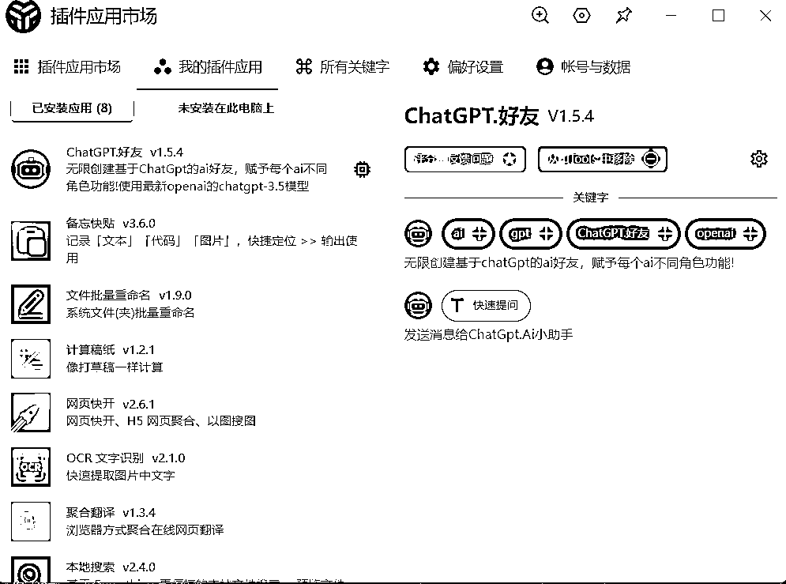

# 好用的效率工具 u-tools 分享

> 原文：[`www.yuque.com/for_lazy/xkrm14/agsdzaodo54evg7s`](https://www.yuque.com/for_lazy/xkrm14/agsdzaodo54evg7s)

作者： 弗林

日期：2023-04-04

点赞数：110

<ne-hole id="u72c25056" data-lake-id="u72c25056"><ne-card data-card-name="hr" data-card-type="block" id="CSNMi" data-event-boundary="card">

正文：

今天访问 ChatGPT,发现 IP 被封了。要重新搭 VVV，就想着先找个平替先用着，不然这工作效率上不去啊！[呲牙]真巧了，群里大佬分享了一个好用的效率工具 u- tools,里面工具都是以插件形式展现的，真的强大到爆炸，好像也可以开发插件上传变现。具体大家可以去玩一下。[uTools+-+你的生产力工具集](https://open.u-tools.cn/460304.html)

<ne-card data-card-name="image" data-card-type="inline" id="uQ0OY" data-event-boundary="card"></ne-card>

<ne-hole id="ub54bab09" data-lake-id="ub54bab09"><ne-card data-card-name="hr" data-card-type="block" id="KWttS" data-event-boundary="card">

评论区：

正宇 : 好东西，收了，啊哈哈哈

淘气猫（瓶子） : 我去试了，真好用，感谢。顺便写了段说明 [https://vw33bncyqrt.feishu.cn/docx/EL1TdAmvXojBe5x...](https://vw33bncyqrt.feishu.cn/docx/EL1TdAmvXojBe5xXuencK3SlnEe)

黄林风 : 超级好用

大圣 : u-tools 真的好用

发达 : 看了视频功能演示，这个有厉害！

田小田的甜 : 是为什么封了，选了亚洲区吗？

弗林 : 号没封，机房 ip 封了，老美的也封。这段风紧，都不大敢用了^^

田小田的甜 : 好的，那我就别上了，谢谢

<ne-hole id="uf270cea3" data-lake-id="uf270cea3"><ne-card data-card-name="hr" data-card-type="block" id="ugq8j" data-event-boundary="card">

公众号懒人找资源，懒人专属群分享

</ne-card></ne-hole></ne-card></ne-hole></ne-card></ne-hole>