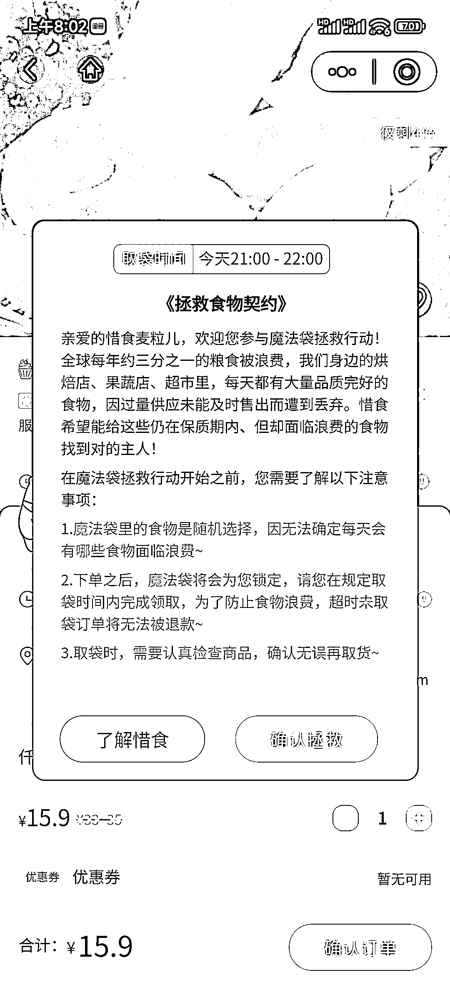
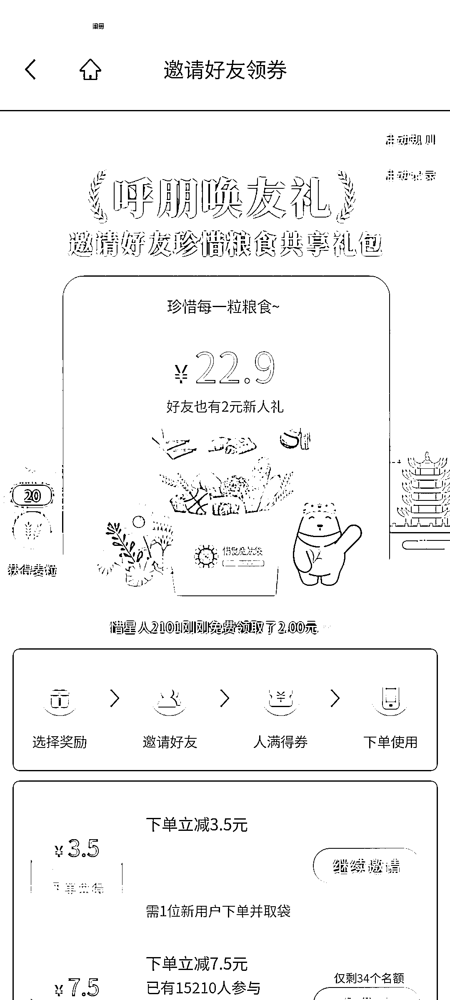

# “惜食魔法袋“，用较低的价格能买到品质完好过量生产的食物

> 原文：[`www.yuque.com/for_lazy/xkrm14/tzmhwryuvluk80nu`](https://www.yuque.com/for_lazy/xkrm14/tzmhwryuvluk80nu)

<ne-p id="uf1b71252" data-lake-id="uf1b71252">作者： 糯米糕</ne-p> <ne-p id="ub8f34b54" data-lake-id="ub8f34b54">日期：2023-04-03</ne-p> <ne-p id="u36440f60" data-lake-id="u36440f60">点赞数：9</ne-p> <ne-hole id="u2719907b" data-lake-id="u2719907b"><ne-card data-card-name="hr" data-card-type="block" id="B8wuI" data-event-boundary="card"><ne-p id="u830a6d10" data-lake-id="u830a6d10">正文：</ne-p> <ne-p id="u946dc5b6" data-lake-id="u946dc5b6">一个叫“惜食魔法袋“的小程序，用较低的价格能买到品质完好、但因过量生产、未能及时售出的食物，主要是当地品牌面包、甜品这些在出炉当天销售的短保食品，从源头上减少浪费。 15 元左右可以买到 30~50 块钱左右的食品，因品牌品质及性价比让买过的人都很愿意分享给自已的亲友，目前只有部份省会城市上线了。</ne-p> <ne-p id="u4502b40d" data-lake-id="u4502b40d"><ne-card data-card-name="image" data-card-type="inline" id="VEFb0" data-event-boundary="card"></ne-card></ne-p> <ne-p id="u0b9f827a" data-lake-id="u0b9f827a"><ne-card data-card-name="image" data-card-type="inline" id="IocIM" data-event-boundary="card"></ne-card></ne-p> <ne-hole id="u13ea2d2a" data-lake-id="u13ea2d2a"><ne-card data-card-name="hr" data-card-type="block" id="Pa4E3" data-event-boundary="card"><ne-p id="uf336c4ef" data-lake-id="uf336c4ef">评论区：</ne-p> <ne-p id="ub75120d8" data-lake-id="ub75120d8">暂无评论</ne-p> <ne-hole id="uc1c618d3" data-lake-id="uc1c618d3"><ne-card data-card-name="hr" data-card-type="block" id="cXtg0" data-event-boundary="card"><ne-p id="u02b50920" data-lake-id="u02b50920">公众号懒人找资源，懒人专属群分享</ne-p></ne-card></ne-hole></ne-card></ne-hole></ne-card></ne-hole>