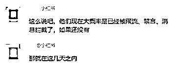
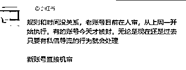
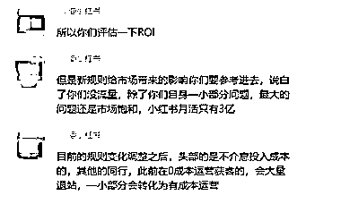

# 小红书，涉及到商业私信性质的账号都会被屏蔽私信

> 原文：[`www.yuque.com/for_lazy/xkrm14/ph0b89feynvp2qsb`](https://www.yuque.com/for_lazy/xkrm14/ph0b89feynvp2qsb)

作者： 熠冉爸爸

日期：2023-04-07

点赞数：53

正文：

小红书只要涉及到商业私信性质的账号，接下来都可能会被屏蔽私信，目前我们项目的账号已经被限制了。目前通过官方人员的沟通了解得知 1.想要恢复私信，保证私信不会被限制，就要投放！最低 1w 起。 2.在目前的政策下，在投放开始的 3 个月内私信不出问题，3 个月后就要重新投放了 各行各业 肯定会退出一大部分人

  

  

  

  

  

评论区：

Luck : 是小红薯官方客服回应的吗？

熠冉爸爸 : 官方负责投放对接的人员

Luck : 以后是不是不付费投流随时会给禁言

孙不飞 : 企业号是不是可以私信？

墨也 : 官方人员用词挺明目张胆阿

思洋 : 2000 依然可以

地表最强运营商 帅方 : 哈哈哈哈 是的。我们已经报白名单了[得意][得意]

地表最强运营商 帅方 : 但是这个白名单并不是不会被封。还是会被封。但是封了可以解

公众号懒人找资源，懒人专属群分享

</ne-p></ne-p></ne-p></ne-p></ne-p>