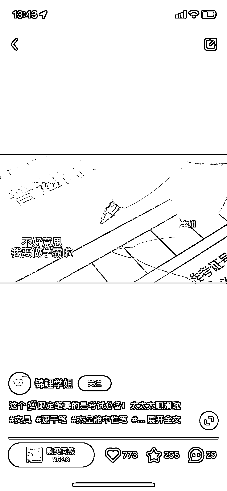

# 小红书求学平台类退货率低的选品建议

> 原文：[`www.yuque.com/for_lazy/xkrm14/zlsq8gh3eiez2xfv`](https://www.yuque.com/for_lazy/xkrm14/zlsq8gh3eiez2xfv)

<ne-p id="u206abfe6" data-lake-id="u206abfe6">作者： 北斗</ne-p> <ne-p id="u0e39398f" data-lake-id="u0e39398f">日期：2023-04-07</ne-p> <ne-p id="uca7801b4" data-lake-id="uca7801b4">点赞数：51</ne-p> <ne-hole id="udcd4f607" data-lake-id="udcd4f607"><ne-card data-card-name="hr" data-card-type="block" id="uCHUf" data-event-boundary="card"><ne-p id="u03930354" data-lake-id="u03930354">正文：</ne-p> <ne-p id="u43223365" data-lake-id="u43223365">不同人群有不同的人生重点，小红书学生党，之前卖几十的衣服退货率高售后事多。但看平台求学类，从文具到饰品到挂件，衍生出一堆产品，矩阵化退货率低，五十多块的考试笔也能卖</ne-p> <ne-p id="u046937af" data-lake-id="u046937af"><ne-card data-card-name="image" data-card-type="inline" id="rM9Uy" data-event-boundary="card"></ne-card></ne-p> <ne-p id="u18436404" data-lake-id="u18436404"><ne-card data-card-name="image" data-card-type="inline" id="RhNmf" data-event-boundary="card"></ne-card></ne-p> <ne-p id="u2920a1c1" data-lake-id="u2920a1c1"><ne-card data-card-name="image" data-card-type="inline" id="L8nos" data-event-boundary="card"></ne-card></ne-p> <ne-hole id="u2e73eb3c" data-lake-id="u2e73eb3c"><ne-card data-card-name="hr" data-card-type="block" id="PhdNu" data-event-boundary="card"><ne-p id="u2f117ed2" data-lake-id="u2f117ed2">评论区：</ne-p> <ne-p id="uf24721e8" data-lake-id="uf24721e8">暂无评论</ne-p> <ne-hole id="u4e351820" data-lake-id="u4e351820"><ne-card data-card-name="hr" data-card-type="block" id="x3Buf" data-event-boundary="card"><ne-p id="ubcd407c6" data-lake-id="ubcd407c6">公众号懒人找资源，懒人专属群分享</ne-p></ne-card></ne-hole></ne-card></ne-hole></ne-card></ne-hole>