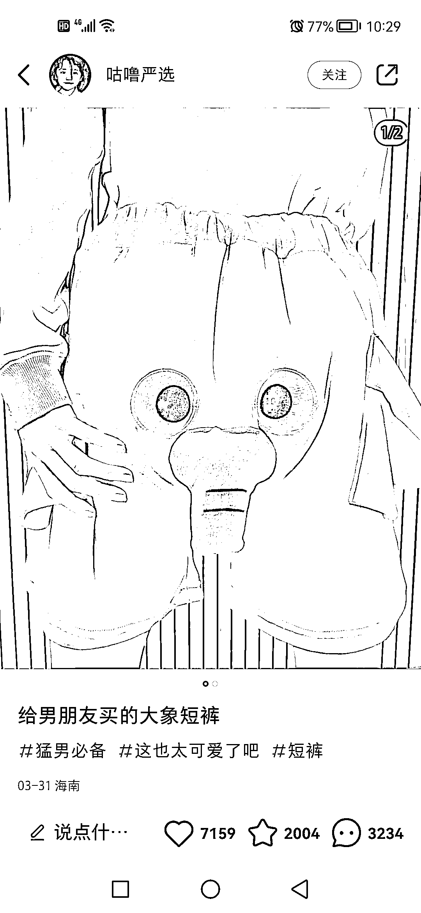
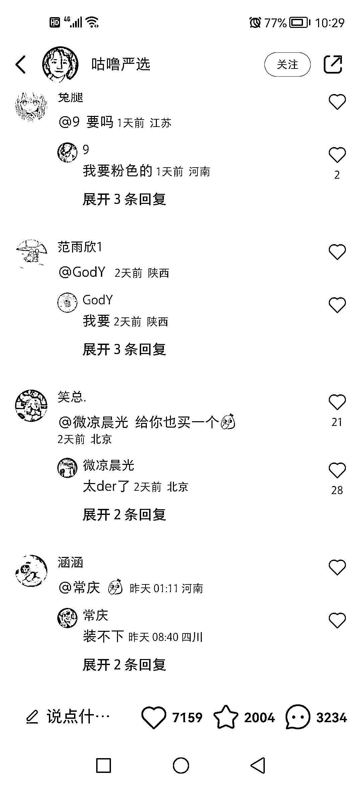

# 小红书店铺项目最近很火，给男女朋友送礼物引发评论

> 原文：[`www.yuque.com/for_lazy/xkrm14/db47ffgvu1ofem4q`](https://www.yuque.com/for_lazy/xkrm14/db47ffgvu1ofem4q)

<ne-p id="u822eeb2b" data-lake-id="u822eeb2b"><ne-text id="ud157faf4">作者： 老彭</ne-text></ne-p> <ne-p id="u83829f91" data-lake-id="u83829f91"><ne-text id="uf2999924">日期：2023-04-07</ne-text></ne-p> <ne-p id="u46665431" data-lake-id="u46665431"><ne-text id="uf9c29484">点赞数：</ne-text><ne-text id="u690dbd7e" ne-bold="true">47</ne-text></ne-p> <ne-hole id="u4db850f2" data-lake-id="u4db850f2"><ne-card data-card-name="hr" data-card-type="block" id="baxop" data-event-boundary="card"><ne-p id="ue5ec7ee6" data-lake-id="ue5ec7ee6"><ne-text id="u2fbcbac6">正文：</ne-text></ne-p> <ne-p id="u2b48b4ba" data-lake-id="u2b48b4ba"><ne-text id="ufd5afb14">小红书店铺项目最近很火，分享驱动算法的一种选品方式， 「给男/女朋友买的某某商品」，吸引一方看到后主动艾特另一方，评论区一下子就火起来了，帖子也就火起来了</ne-text></ne-p> <ne-p id="ubb7d295f" data-lake-id="ubb7d295f"><ne-card data-card-name="image" data-card-type="inline" id="eJOWu" data-event-boundary="card"></ne-card></ne-p> <ne-p id="u83cfc426" data-lake-id="u83cfc426"><ne-card data-card-name="image" data-card-type="inline" id="MkIpj" data-event-boundary="card"></ne-card></ne-p> <ne-hole id="u81f2b53e" data-lake-id="u81f2b53e"><ne-card data-card-name="hr" data-card-type="block" id="rAlDK" data-event-boundary="card"><ne-p id="uf0637314" data-lake-id="uf0637314"><ne-text id="ued667931">评论区：</ne-text></ne-p> <ne-p id="u509cb587" data-lake-id="u509cb587"><ne-text id="ue385fc87">Aaron : 挂商品链接，流量是不是会减少啊</ne-text></ne-p> <ne-hole id="u4e3df594" data-lake-id="u4e3df594"><ne-card data-card-name="hr" data-card-type="block" id="vha7a" data-event-boundary="card"><ne-p id="ud123fc1b" data-lake-id="ud123fc1b"><ne-text id="uad53aaf2">公众号懒人找资源，懒人专属群分享</ne-text></ne-p></ne-card></ne-hole></ne-card></ne-hole></ne-card></ne-hole>