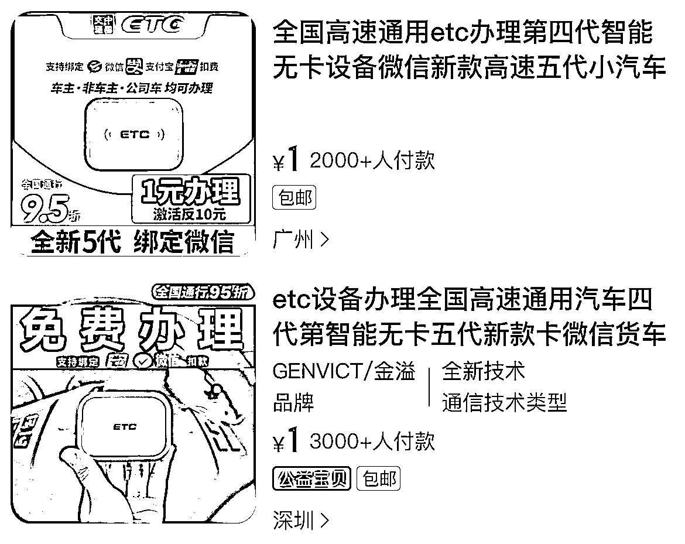

# 淘宝搜索有 1 元包邮办理的 ETC,开通成功佣金三位数

> 原文：[`www.yuque.com/for_lazy/xkrm14/cyo3e5xyfd4g1sbb`](https://www.yuque.com/for_lazy/xkrm14/cyo3e5xyfd4g1sbb)

<ne-p id="u9db42c05" data-lake-id="u9db42c05">作者： 冲冲冲</ne-p> <ne-p id="uc671277e" data-lake-id="uc671277e">日期：2023-04-06</ne-p> <ne-p id="ud140a6d2" data-lake-id="ud140a6d2">点赞数：20</ne-p> <ne-hole id="u29c675b0" data-lake-id="u29c675b0"><ne-card data-card-name="hr" data-card-type="block" id="Io1cm" data-event-boundary="card"><ne-p id="uf31c9d9b" data-lake-id="uf31c9d9b">正文：</ne-p> <ne-p id="u8cff304d" data-lake-id="u8cff304d">最近刷到不少免费办理 ETC 的，听说也是类似办信用卡的模式，开通成功佣金三位数，然后去淘宝搜索有 1 元包邮办理的，看了下没开车，月销 2000+，感觉比抖音付款 39-49 到货再全返更容易成单，就是要考虑到到货后的核销率，成本：设备➕运费，如果利润裹得住，淘宝等电商平台也是个不错的机会</ne-p> <ne-p id="ud045fc61" data-lake-id="ud045fc61"><ne-card data-card-name="image" data-card-type="inline" id="rbthG" data-event-boundary="card"></ne-card></ne-p> <ne-p id="uadefdb85" data-lake-id="uadefdb85"><ne-card data-card-name="image" data-card-type="inline" id="GAisu" data-event-boundary="card"></ne-card></ne-p> <ne-hole id="uca841460" data-lake-id="uca841460"><ne-card data-card-name="hr" data-card-type="block" id="o6JHz" data-event-boundary="card"><ne-p id="u086d5097" data-lake-id="u086d5097">评论区：</ne-p> <ne-p id="u1c9f49b4" data-lake-id="u1c9f49b4">暂无评论</ne-p> <ne-hole id="u39c21367" data-lake-id="u39c21367"><ne-card data-card-name="hr" data-card-type="block" id="PFbbB" data-event-boundary="card"><ne-p id="ud42ed655" data-lake-id="ud42ed655">公众号懒人找资源，懒人专属群分享</ne-p></ne-card></ne-hole></ne-card></ne-hole></ne-card></ne-hole>