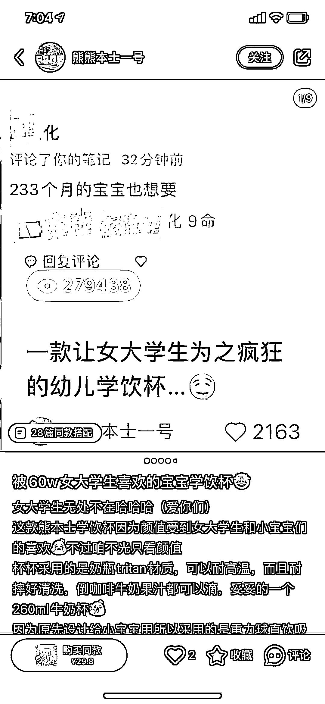
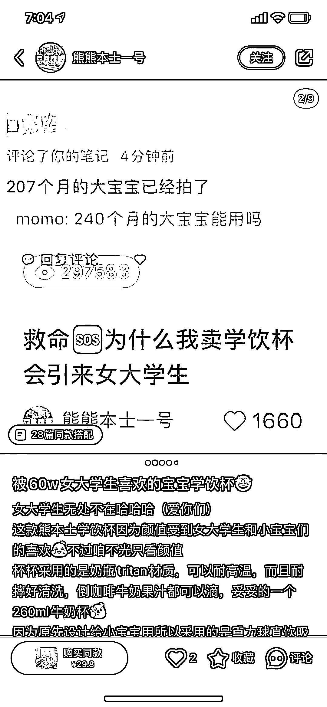
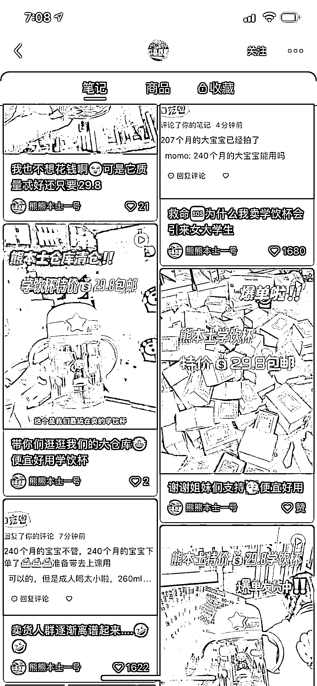
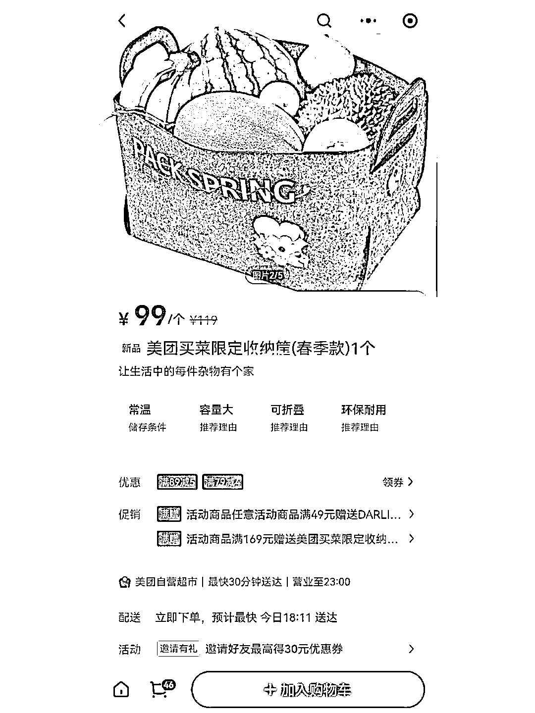
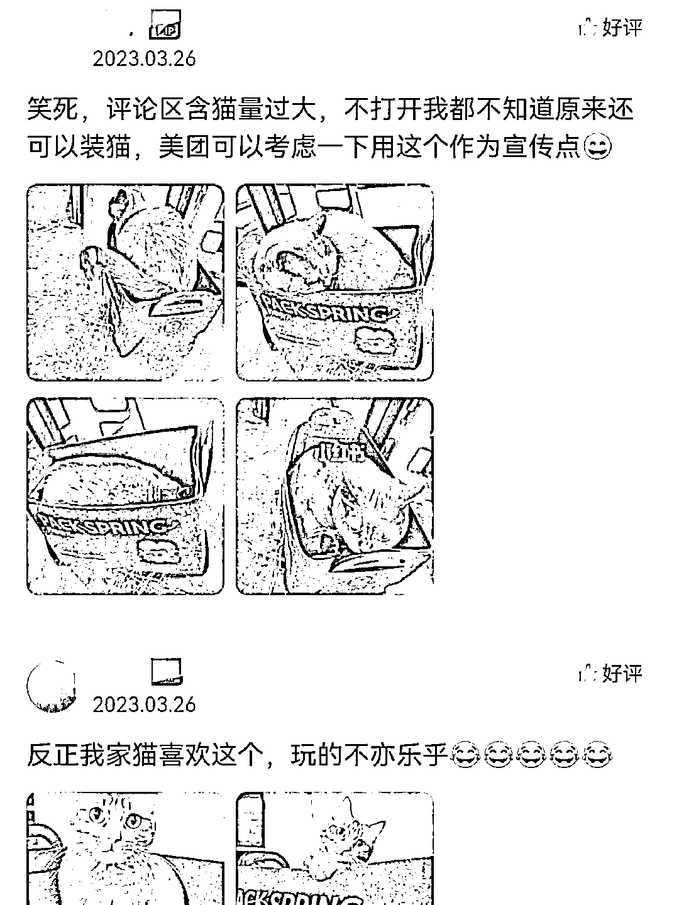
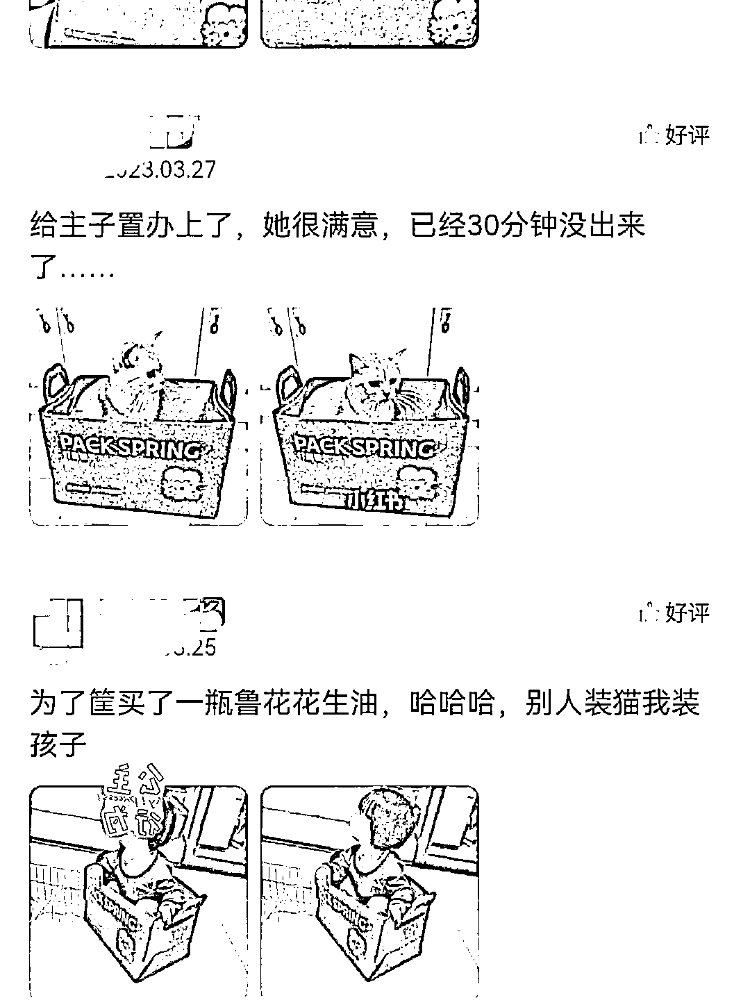

# 小红书卖宝宝学饮杯 60W 女大学生浏览，人群不对但流量翻倍

> 原文：[`www.yuque.com/for_lazy/xkrm14/itk79ftnumdcuegs`](https://www.yuque.com/for_lazy/xkrm14/itk79ftnumdcuegs)

作者： 戴懿菡 Amy

日期：2023-04-05

点赞数：66

<ne-hole id="u8a4ec0b3" data-lake-id="u8a4ec0b3">

正文：

人群不对，流量翻倍 小红书卖宝宝学饮杯，60w 女大学生浏览，3.2 日第一篇笔记，3.18 第一条挂链接笔记，29.8 元*3000+销售=9.1 万元 同理还有美团买菜的 99 元收纳筐，对大爷大妈很贵，对铲屎官来说，主子喜欢就好

<ne-hole id="ufc982b3c" data-lake-id="ufc982b3c">

评论区：

感恩学习相信-小陶 : 太可爱了吧！我家小胖猫肯定也习惯[偷笑]

戴懿菡 Amy : 给主子试试[旺柴]

<ne-hole id="uf5ac8e5a" data-lake-id="uf5ac8e5a">

公众号懒人找资源，懒人专属群分享

</ne-hole></ne-hole></ne-hole>