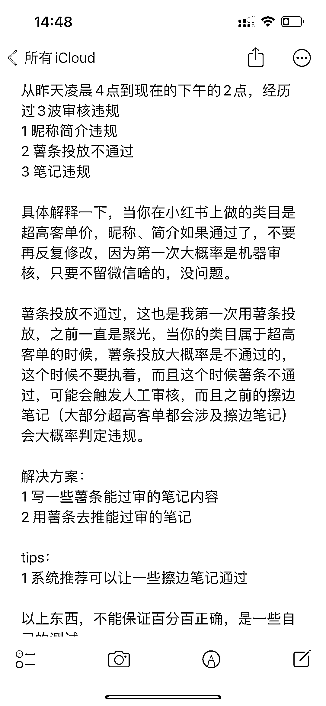

# 分享一些小红书笔记审核的经验

> 原文：[`www.yuque.com/for_lazy/xkrm14/lbmelwv5c27avzn1`](https://www.yuque.com/for_lazy/xkrm14/lbmelwv5c27avzn1)

作者： Vicent

日期：2023-04-04

点赞数：26

正文：

分享一些小红书 笔记审核的经验

评论区：

Ante : 这两天感觉小红书流量突然降了

Vicent : 可以在创作中心看一下流量来源，尽量抓推荐流量

Ante : 粉丝少，看不了数据[捂脸]

Vicent : 多发帖子，先把播放量拉上去

思洋 : 看自己是否在大流量情况下有没有引流

Vicent : 今天再回复一下，前天因为昵称违规以后，我改了新的名字，然后笔记的流量就暴跌了……

Vicent : 那个账号被判定违规（昵称、简介、内容）三违规，后续大家小心。

公众号懒人找资源，懒人专属群分享

