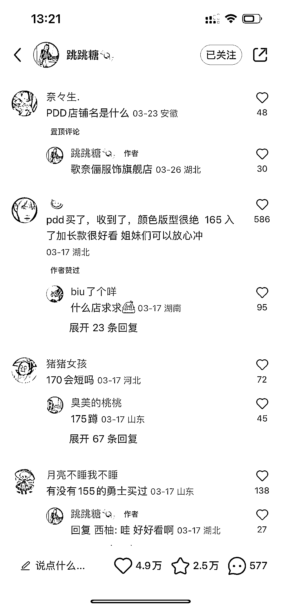

# 小红书发天猫和拼多多店铺的价格对比图，导流到拼多多店铺

> 原文：[`www.yuque.com/for_lazy/xkrm14/cyihhpnb24psqrat`](https://www.yuque.com/for_lazy/xkrm14/cyihhpnb24psqrat)

作者： 多闻

日期：2023-04-04

点赞数：40

<ne-hole id="uf1a1c27c" data-lake-id="uf1a1c27c"><ne-card data-card-name="hr" data-card-type="block" id="W9PFC" data-event-boundary="card">

正文：

【仅分享普通人最容易变现的风向标】 小红书发天猫和拼多多店铺的价格对比图，图文非常简单，评论用小号问哪个店铺，然后导流到拼多多店铺。 这种也可以发和其他平台的对比图，如果想引流到私域，也可以发天猫和小程序价格的对比图，有人问就拉小红书群，群里留微信。

<ne-card data-card-name="image" data-card-type="inline" id="hNKei" data-event-boundary="card"></ne-card>

<ne-card data-card-name="image" data-card-type="inline" id="u8Rpi" data-event-boundary="card"></ne-card>

<ne-card data-card-name="image" data-card-type="inline" id="KGYuq" data-event-boundary="card"></ne-card>

<ne-card data-card-name="image" data-card-type="inline" id="ZzMNS" data-event-boundary="card"></ne-card>

<ne-card data-card-name="image" data-card-type="inline" id="j0IZL" data-event-boundary="card"></ne-card>

<ne-card data-card-name="image" data-card-type="inline" id="F1Pp3" data-event-boundary="card"></ne-card>

<ne-hole id="ua7e8aee6" data-lake-id="ua7e8aee6"><ne-card data-card-name="hr" data-card-type="block" id="enKjp" data-event-boundary="card">

评论区：

吾爱诗词 : 给拼多多店铺引流吗？自己没有拼多多店铺呢？要与店家谈合作吗？

多闻 : 开个拼多多店铺也不难，也可以导流到私域，比如跟自己的小程序产品比价。

君顾 : 有个想法可以引流到自己的小红书店铺，直接对接 1688 一件代发货源，店名直接就是全网性价比最高女装店。

多闻 : 挂小红书店铺链接就没那么大流量了

<ne-hole id="u31fc4337" data-lake-id="u31fc4337"><ne-card data-card-name="hr" data-card-type="block" id="Os2Ha" data-event-boundary="card">

公众号懒人找资源，懒人专属群分享

</ne-card></ne-hole></ne-card></ne-hole></ne-card></ne-hole>