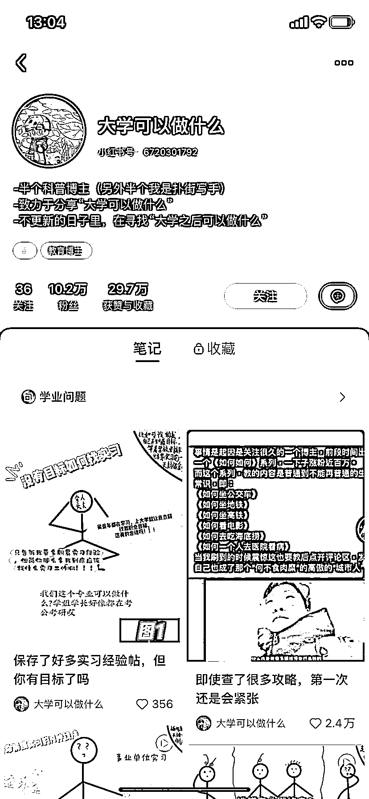

# 小红书选题职场、副业可以做什么 .....这个系列可以无限延伸

> 原文：[`www.yuque.com/for_lazy/xkrm14/ahle7121h3malfqg`](https://www.yuque.com/for_lazy/xkrm14/ahle7121h3malfqg)

<ne-p id="u53f081b0" data-lake-id="u53f081b0">作者： 雪碧</ne-p> <ne-p id="u00fd7b10" data-lake-id="u00fd7b10">日期：2023-04-04</ne-p> <ne-p id="u0cd15477" data-lake-id="u0cd15477">点赞数：77</ne-p> <ne-hole id="u44f68814" data-lake-id="u44f68814"><ne-card data-card-name="hr" data-card-type="block" id="wT0f9" data-event-boundary="card"><ne-p id="ub964549d" data-lake-id="ub964549d">正文：</ne-p> <ne-p id="u4eba9d0d" data-lake-id="u4eba9d0d">这个账号 五篇笔记涨粉十万，选题就是大学可以做什么。学生时代的标准答案模式造成了很多人在人生的某个阶段做 xx 的时候，都渴望一个标准答案 延伸一下： 职场可以做什么 副业可以做什么 去旅游可以做什么 .....这个系列可以无限延伸</ne-p> <ne-p id="ud91c8195" data-lake-id="ud91c8195"><ne-card data-card-name="image" data-card-type="inline" id="G4JCZ" data-event-boundary="card"></ne-card></ne-p> <ne-hole id="u0c75a7b9" data-lake-id="u0c75a7b9"><ne-card data-card-name="hr" data-card-type="block" id="C5G19" data-event-boundary="card"><ne-p id="u59f5d97d" data-lake-id="u59f5d97d">评论区：</ne-p> <ne-p id="uf54c8c31" data-lake-id="uf54c8c31">lydia : 会不会是其他笔记隐藏了哈哈</ne-p> <ne-p id="u83cde557" data-lake-id="u83cde557">豆豆 : 也有可能</ne-p> <ne-p id="u0d9686c0" data-lake-id="u0d9686c0">君顾 : 这个模式可以怎么样变现呢？具体做什么的资料售卖？</ne-p> <ne-p id="ua32c560d" data-lake-id="ua32c560d">胡一游 : 这个引流很精准啊</ne-p> <ne-p id="uc1b06622" data-lake-id="uc1b06622">雪碧 : 为什么一定要卖资料呢，和机构合作卖考研，考公课程；卖广告；带货大学生用品；变现思路应该非常多</ne-p> <ne-p id="uc04521bb" data-lake-id="uc04521bb">IDO 老徐 : 这个思路不错，确实可玩，可对标，可延伸</ne-p> <ne-p id="u746468ba" data-lake-id="u746468ba">深圳大冲 : 学习[强]</ne-p> <ne-p id="ueb41829a" data-lake-id="ueb41829a">小六六~ : 我关注了，跟这个同类的还有二本可以做什么，也有好几万粉丝了😂</ne-p> <ne-hole id="u69a00881" data-lake-id="u69a00881"><ne-card data-card-name="hr" data-card-type="block" id="EKahq" data-event-boundary="card"><ne-p id="u49bc0b0a" data-lake-id="u49bc0b0a">公众号懒人找资源，懒人专属群分享</ne-p></ne-card></ne-hole></ne-card></ne-hole></ne-card></ne-hole>