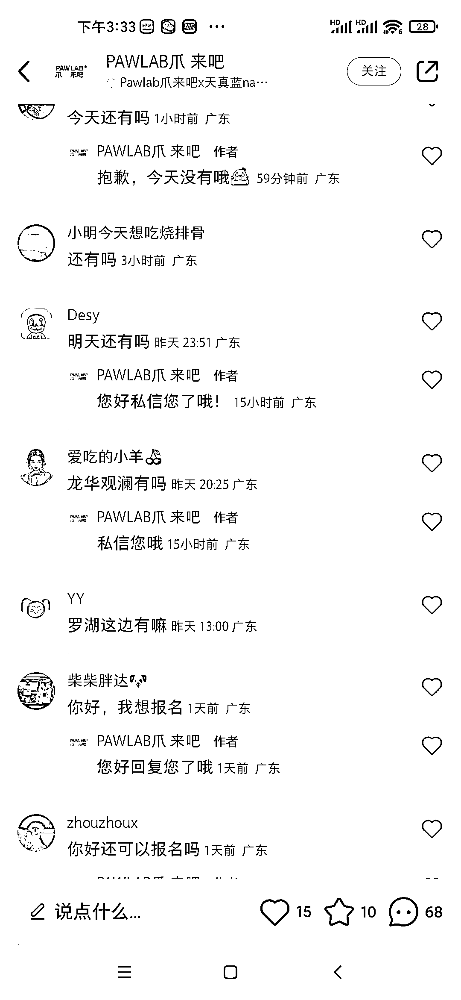

# 忠犬八公上映，小红书发布组团携宠观影笔记引流

> 原文：[`www.yuque.com/for_lazy/xkrm14/cwkl8ar4h6k21wgp`](https://www.yuque.com/for_lazy/xkrm14/cwkl8ar4h6k21wgp)

作者： 老孙说经济

日期：2023-04-03

点赞数：28

正文：

忠犬八公上映。小红书发布组团携宠观影笔记 ，流量巨大 各个城市都可以组织，并且可以拉到赞助商，减低成本，提供摄影服务，加微信领照片，自己收费，一场电影 100 人，88 元/人，一场营收 8800 元，之后在沉淀私域微信，都是精准本地宠物粉丝，加公众号，进行持续转化

评论区：

李盼达 : 抓到痛点了，很精准。

公众号懒人找资源，懒人专属群分享

