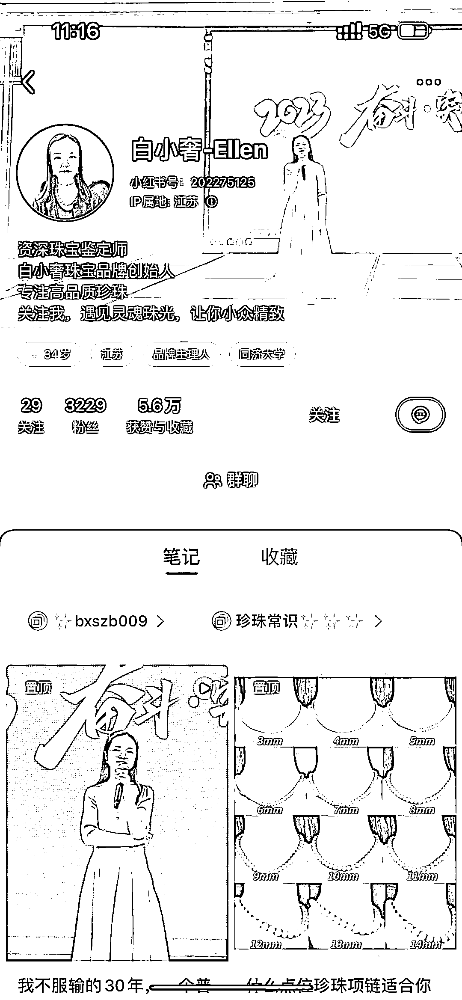
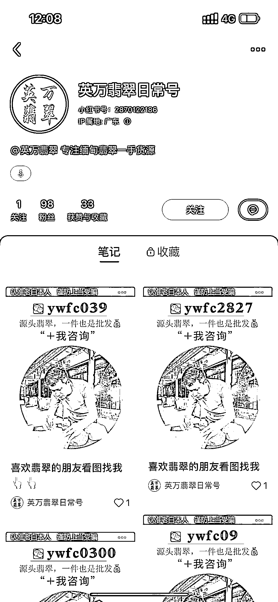
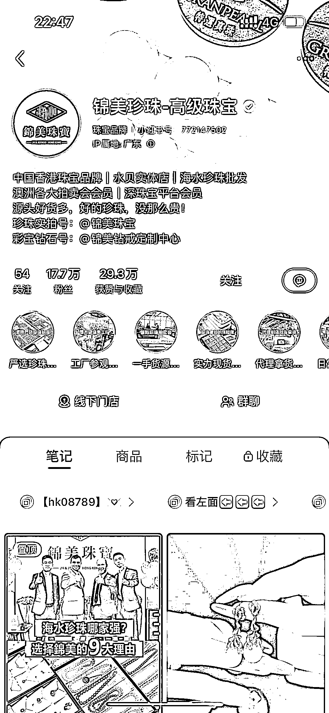

# 小红书主页引流的思路分享

> 原文：[`www.yuque.com/for_lazy/xkrm14/qlxh2p7w69ioufrz`](https://www.yuque.com/for_lazy/xkrm14/qlxh2p7w69ioufrz)

作者： 马克图布

日期：2023-04-03

点赞数：35

<ne-hole id="ue636c54a" data-lake-id="ue636c54a"><ne-card data-card-name="hr" data-card-type="block" id="K1CXV" data-event-boundary="card">

正文：

分享一下小红书主页引流的思路。 一般都是学习那些喜欢引流私域的人。比如珍珠，玉石，房地产等。截图这几个就把引流方式做得特别绝，跟着抄就好了，只要不被同行举报。

<ne-card data-card-name="image" data-card-type="inline" id="tSfiK" data-event-boundary="card"></ne-card>

<ne-card data-card-name="image" data-card-type="inline" id="c0hTT" data-event-boundary="card"></ne-card>

<ne-card data-card-name="image" data-card-type="inline" id="SLqqS" data-event-boundary="card"></ne-card>

<ne-card data-card-name="image" data-card-type="inline" id="aO5h8" data-event-boundary="card"></ne-card>

<ne-card data-card-name="image" data-card-type="inline" id="cpCrm" data-event-boundary="card"></ne-card>

<ne-card data-card-name="image" data-card-type="inline" id="LiqTR" data-event-boundary="card"></ne-card>

<ne-hole id="u4fa53ff5" data-lake-id="u4fa53ff5"><ne-card data-card-name="hr" data-card-type="block" id="fshmm" data-event-boundary="card">

评论区：

暂无评论

<ne-hole id="u0da1951a" data-lake-id="u0da1951a"><ne-card data-card-name="hr" data-card-type="block" id="wUSCG" data-event-boundary="card">

公众号懒人找资源，懒人专属群分享

</ne-card></ne-hole></ne-card></ne-hole></ne-card></ne-hole>