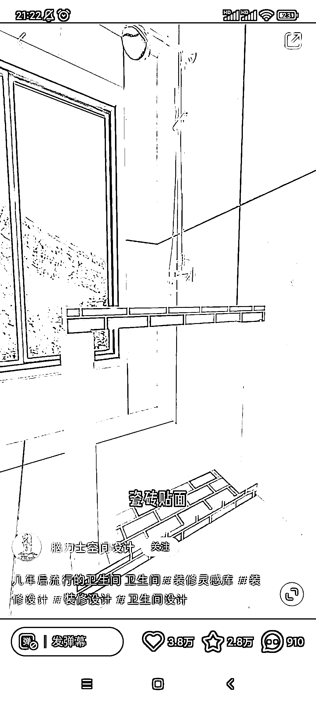
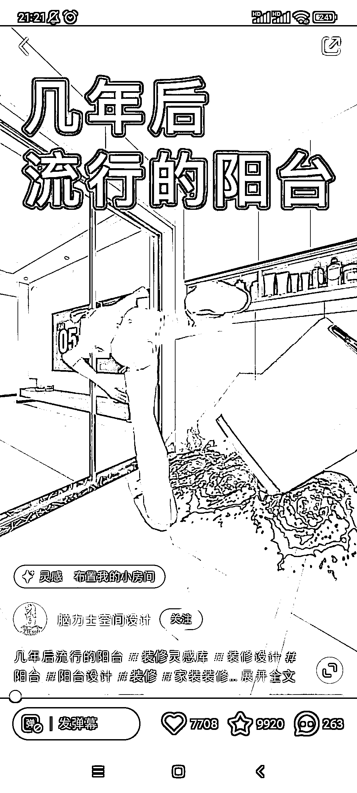

# 小红书装修号 CG 游戏化 CG 动画配合故事剧情，百万赞

> 原文：[`www.yuque.com/for_lazy/xkrm14/lessgu4bqbdyzqeu`](https://www.yuque.com/for_lazy/xkrm14/lessgu4bqbdyzqeu)

作者： 阿黎

日期：2023-04-03

点赞数：16

<ne-hole id="ub74aecf7" data-lake-id="ub74aecf7">

正文：

异常值 百万赞，40 万粉，内容都是装修的内容，表现形式 CG 游戏化 CG 动画配合故事剧情，讲老婆受不了家里卫生间，奋起改造的过程。 1 用类似游戏的剧情冲突抓人 2 用 cg 动画展示改造前后的对比，所见即所得 3 用装修改造专业知识，秀肌肉，提方案

<ne-hole id="u427c628e" data-lake-id="u427c628e">

评论区：

暂无评论

<ne-hole id="u74bccdf1" data-lake-id="u74bccdf1">

公众号懒人找资源，懒人专属群分享

</ne-hole></ne-hole></ne-hole>