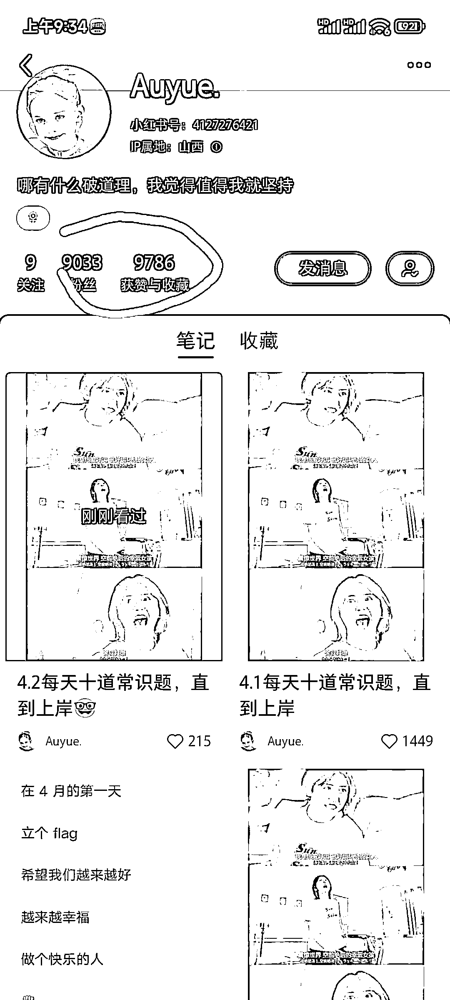

# 小红书考公笔记连载，互动数据非常好

> 原文：[`www.yuque.com/for_lazy/xkrm14/sz6dlg7911ysfwqz`](https://www.yuque.com/for_lazy/xkrm14/sz6dlg7911ysfwqz)

<ne-p id="u27845c06" data-lake-id="u27845c06">作者： 糯米糕</ne-p> <ne-p id="u355ba67c" data-lake-id="u355ba67c">日期：2023-04-03</ne-p> <ne-p id="uc44aec2a" data-lake-id="uc44aec2a">点赞数：17</ne-p> <ne-hole id="ub06c9dcd" data-lake-id="ub06c9dcd"><ne-card data-card-name="hr" data-card-type="block" id="cBsPC" data-event-boundary="card"><ne-p id="ube0969f7" data-lake-id="ube0969f7">正文：</ne-p> <ne-p id="u580d590f" data-lake-id="u580d590f">小红书考公笔记连载 笔记发“每天十道（考公）常识题”，3 月 28 号起号发笔记，30 号第三篇上了小红书低粉爆文榜，6 篇笔记共涨粉 9k+(4 月 1 日水文)，互动数据也非常好。</ne-p> <ne-p id="u7c4f5c39" data-lake-id="u7c4f5c39"><ne-card data-card-name="image" data-card-type="inline" id="tRPpe" data-event-boundary="card"></ne-card></ne-p> <ne-hole id="u7e8e25a9" data-lake-id="u7e8e25a9"><ne-card data-card-name="hr" data-card-type="block" id="pZyhD" data-event-boundary="card"><ne-p id="uda7eeb43" data-lake-id="uda7eeb43">评论区：</ne-p> <ne-p id="uffb8eea0" data-lake-id="uffb8eea0">侯小凌 : 扛打的每天</ne-p> <ne-hole id="u1aad90d0" data-lake-id="u1aad90d0"><ne-card data-card-name="hr" data-card-type="block" id="aCVSp" data-event-boundary="card"><ne-p id="u104dbd51" data-lake-id="u104dbd51">公众号懒人找资源，懒人专属群分享</ne-p></ne-card></ne-hole></ne-card></ne-hole></ne-card></ne-hole>