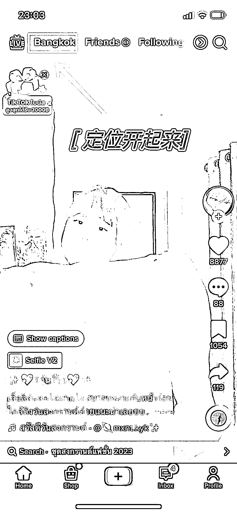

# TikTok 本地朋友圈开启，只要打开手机定位，账号就会出现同城信息流

> 原文：[`www.yuque.com/for_lazy/xkrm14/tng0eg5y2l35p0nb`](https://www.yuque.com/for_lazy/xkrm14/tng0eg5y2l35p0nb)

<ne-p id="udeb75cec" data-lake-id="udeb75cec"><ne-text id="u746e89c6">作者： 莫宁兔</ne-text></ne-p> <ne-p id="ua784d7b5" data-lake-id="ua784d7b5"><ne-text id="u2ba264af">日期：2023-04-06</ne-text></ne-p> <ne-p id="u17235bfb" data-lake-id="u17235bfb"><ne-text id="u34466884">点赞数：</ne-text><ne-text id="u57cfb434" ne-bold="true">32</ne-text></ne-p> <ne-hole id="u3c3520e8" data-lake-id="u3c3520e8"><ne-card data-card-name="hr" data-card-type="block" id="FTjL7" data-event-boundary="card"><ne-p id="ucfdc5c38" data-lake-id="ucfdc5c38"><ne-text id="u62f93494">正文：</ne-text></ne-p> <ne-p id="u9853fe4f" data-lake-id="u9853fe4f"><ne-text id="u753aa399">TikTok 本地朋友圈开启了，只要你打开手机定位，账号就会出现同城信息流！ 国内玩家接下来可以把定位开起来了！</ne-text></ne-p> <ne-p id="uf9780eb5" data-lake-id="uf9780eb5"><ne-card data-card-name="image" data-card-type="inline" id="srMLG" data-event-boundary="card"></ne-card></ne-p> <ne-hole id="u22969fc5" data-lake-id="u22969fc5"><ne-card data-card-name="hr" data-card-type="block" id="n3EoT" data-event-boundary="card"><ne-p id="ua6d9da4c" data-lake-id="ua6d9da4c"><ne-text id="u12074576">评论区：</ne-text></ne-p> <ne-p id="ubb43a980" data-lake-id="ubb43a980"><ne-text id="u54c14789">天启 : 现在 tk 还在外国人吗？</ne-text></ne-p> <ne-p id="uc661f740" data-lake-id="uc661f740"><ne-text id="ud90d9df1">莫宁兔 : 你好，没有看懂你的问题。</ne-text></ne-p> <ne-p id="u2fdc911e" data-lake-id="u2fdc911e"><ne-text id="u574cc688">Sunwei : 国内账号开了定位，会不会直接看不到任何内容了，前几天注册 Tik 账号（邮箱/海外手机号），即便关闭了定位，也是直接注册失败…</ne-text></ne-p> <ne-p id="u29efe7ea" data-lake-id="u29efe7ea"><ne-text id="u522bea20">Jie9125084* : 不用海外手机号也可以注册，搞定 gmail 邮箱，把系统改成英文或者自己熟悉的外国语种，然后去注册就可以。</ne-text></ne-p> <ne-p id="ube2aa90c" data-lake-id="ube2aa90c"><ne-text id="u8d4e7f8f">Sunwei : 谢谢</ne-text></ne-p> <ne-p id="ua7786023" data-lake-id="ua7786023"><ne-text id="u0b5594b2">Sunwei : Tik 注册/登录页面，选 Gmail，先注册了一个 Gmail，然后注册 TikTok，仍然失败（自动回到 Profile- Sign</ne-text> <ne-text id="uec2d8c78">up），或许我这台设备被标记了，多种注册方式都是失败…</ne-text></ne-p> <ne-p id="u8c7c9bb9" data-lake-id="u8c7c9bb9"><ne-text id="u8dd00926">啊明 : 这个因为你是在泰国吗？如果国内科学上网开定位直接设死的。</ne-text></ne-p> <ne-p id="u8837ae96" data-lake-id="u8837ae96"><ne-text id="uc7de1820">楠 : 在国内玩 tk 的搞不来这一手操作[捂脸]账号分分钟没了</ne-text></ne-p> <ne-hole id="u7842fb87" data-lake-id="u7842fb87"><ne-card data-card-name="hr" data-card-type="block" id="avbWJ" data-event-boundary="card"><ne-p id="u7032e1b5" data-lake-id="u7032e1b5"><ne-text id="u36f802ec">公众号懒人找资源，懒人专属群分享</ne-text></ne-p></ne-card></ne-hole></ne-card></ne-hole></ne-card></ne-hole>