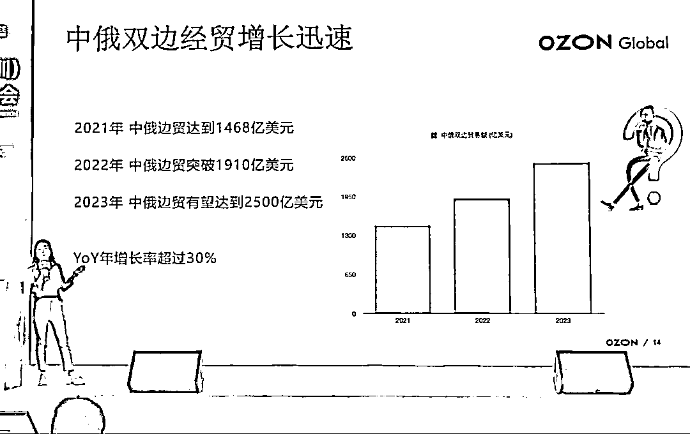
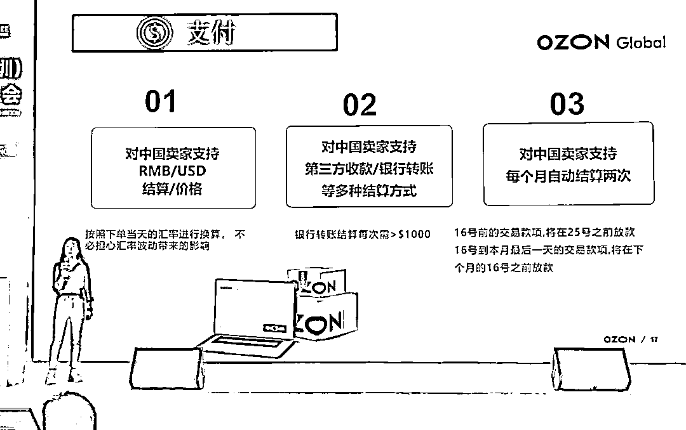
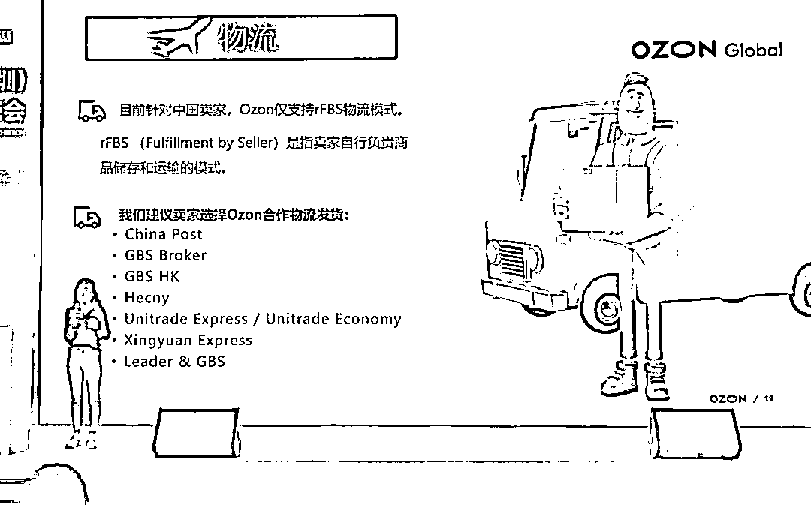
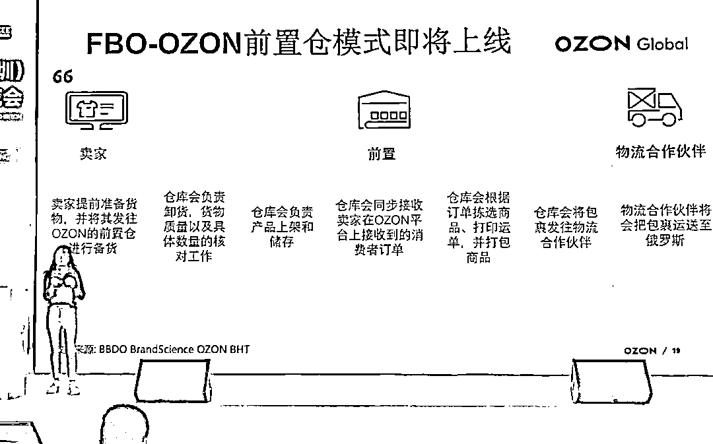
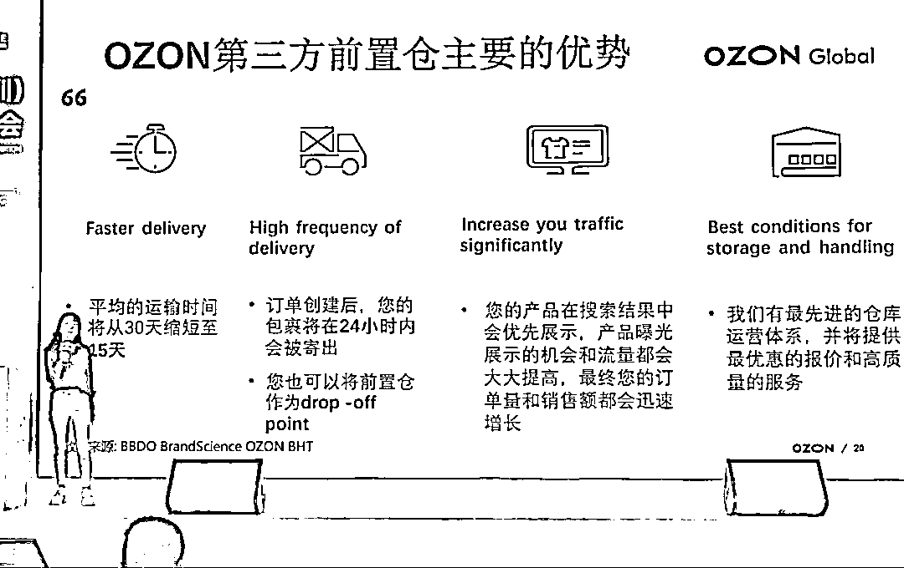
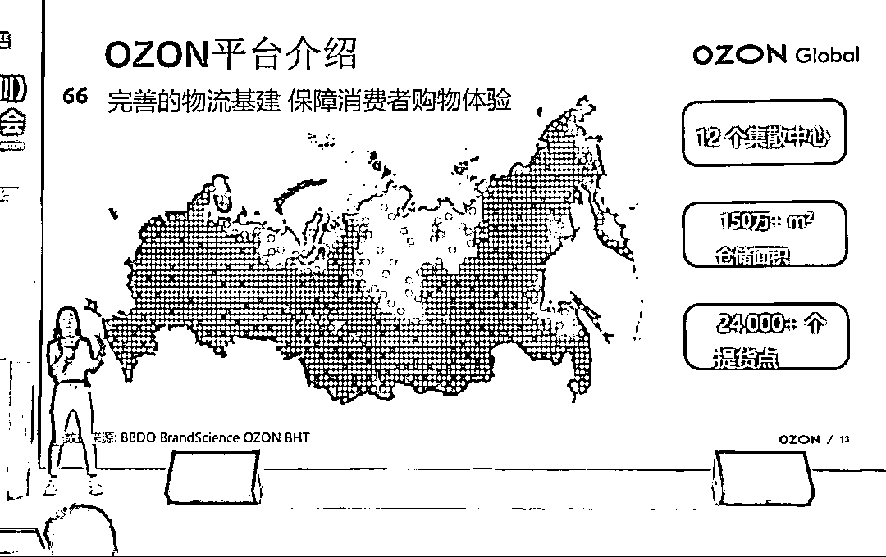

# 最近热度还可以的俄罗斯跨境电商平台 ozon，可以尝试一下

> 原文：[`www.yuque.com/for_lazy/xkrm14/hsy4gpsfeki1gszf`](https://www.yuque.com/for_lazy/xkrm14/hsy4gpsfeki1gszf)

作者： 通路

日期：2023-04-05

点赞数：43

正文：

3 月月底去参加深圳全球跨境电商展览会，有关最近热度还可以的俄罗斯跨境电商平台 ozon 的分享，自己回来后这几天研究了下，感觉做跨境的是可以去尝试一下的，平台还在红利期，故来星球分享一下，希望做跨境的圈友能够注意一下这个平台。结合当时 ppt，我总结下来主要是几个点： 1、俄罗斯电商市场规模 550 亿美金，市场体量还可以。与其他发达市场和中国相比，俄罗斯电商的渗透率只有 10%左右，任然较低，所以电商市场潜力较大。 2、ozon 在俄罗斯有 12 个集散中心，150 万+平方米的仓储面积，另外有 24000+个提货点（这个很重要，有调研反馈俄罗斯居民习惯去提货点去提货），物流体系还算可以 3、中俄近年来一直是非常重要也是非常好的合作伙伴，双边经贸增长迅速，尤其是俄乌战争以来，面对欧美的制裁，俄罗斯对中国的依赖性更大了，2023 年中俄边贸预测能达到 2500 亿美元，年增长率超过 30%。 4、店铺 0 租金入驻，没有月费和年费，算是还在红利期，但是不同类目 ozon 会有一定比例的抽佣，暂不支持个体工商户入驻，支持 RMB/USD 结算，当天下单的订单根据当天的汇率进行换算，消费者确认收货后打入账户，每个月系统自动结算两次货款，每次金额需＞$1000。 5、目前中国卖家仅支持 rFBS 物流模式，需要卖家自行负责商品存储和运输，但是可以选择 ozon 合作的物流发货，并且 ozon 的前置仓马上就会上线，到时候卖家可以把货送到 ozon 前置仓，然后由 ozon 的物流合作伙伴把货运送到俄罗斯。如果选择 ozon 前置仓，运输时间预估可以缩短到 15 天左右，并且在 ozon 商城里有加权，优先展示。

评论区：

陈小胖 : 这个平台，在抖音也有很多跨境博主在推，不知道是不是打广告！

通路 : 其实目前重点问题是第五条。原本物流时效过长，30 天左右的平均时效，发货后退款率肯定会很高，会很亏，如果前置仓的操作能优化到 15 天，那就还好。确实最近 ozon 相关的话题挺多的，应该是官方在推，听说今年他们目标是招 10w 中国卖家入驻，不放心的话建议等前置仓上线后再看看

陈小胖 : [抱拳][抱拳]

周涛 : 好奇问下，速卖通也做俄罗斯电商，觉得速卖通如何？

通路 : 听有个正在做 ozon 的大佬说，体量没有速卖通大，速卖通现在基本都是工厂店多，批发为主，ozon 主要是零售

青春大概 : rus 的 gtp 有点堪忧啊[捂脸]

公众号懒人找资源，懒人专属群分享

