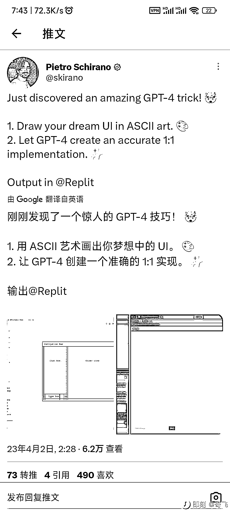

# Twitter 上官方暂时还不开放多模态输入，那就把图片变成字符画，交给 GPT4 理解

> 原文：[`www.yuque.com/for_lazy/xkrm14/zwwspwx3xzg0xgg1`](https://www.yuque.com/for_lazy/xkrm14/zwwspwx3xzg0xgg1)

<ne-p id="u708da18c" data-lake-id="u708da18c"><ne-text id="ude178fc7">作者： fisher</ne-text></ne-p> <ne-p id="uc81b1b4d" data-lake-id="uc81b1b4d"><ne-text id="u41b4365d">日期：2023-04-04</ne-text></ne-p> <ne-p id="uac815aea" data-lake-id="uac815aea"><ne-text id="u4ce604b9">点赞数：</ne-text><ne-text id="u48e89053" ne-bold="true">43</ne-text></ne-p> <ne-hole id="u6a78e770" data-lake-id="u6a78e770"><ne-card data-card-name="hr" data-card-type="block" id="iDdf2" data-event-boundary="card"><ne-p id="u8abdec4e" data-lake-id="u8abdec4e"><ne-text id="u0680eeee">正文：</ne-text></ne-p> <ne-p id="u25d2eb1f" data-lake-id="u25d2eb1f"><ne-text id="ude1671ca">twitter 上看到一个有趣思路，既然官方暂时还不开放多模态输入，那就把图片变成字符画，交给 GPT4 理解。 第一步，打开 创建字符画网页设计。</ne-text> <ne-text id="ude884594">第二步，获取纯文字字符画，提交给 GPT4 得到代码。</ne-text>[<ne-text id="ufddeb1e8">https://asciiflow.com/?fjkqy</ne-text>](https://asciiflow.com/?fjkqy)</ne-p> <ne-p id="u259c9a5d" data-lake-id="u259c9a5d"><ne-card data-card-name="image" data-card-type="inline" id="RKQ1N" data-event-boundary="card"></ne-card></ne-p> <ne-hole id="u5bcd69b4" data-lake-id="u5bcd69b4"><ne-card data-card-name="hr" data-card-type="block" id="FQZVA" data-event-boundary="card"><ne-p id="uf071f174" data-lake-id="uf071f174"><ne-text id="u3daf43ce">评论区：</ne-text></ne-p> <ne-p id="u63be4c73" data-lake-id="u63be4c73"><ne-text id="u2b0b1829">暂无评论</ne-text></ne-p> <ne-hole id="u6296da12" data-lake-id="u6296da12"><ne-card data-card-name="hr" data-card-type="block" id="Sr1cg" data-event-boundary="card"><ne-p id="u576ec3dd" data-lake-id="u576ec3dd"><ne-text id="u13fb3d58">公众号懒人找资源，懒人专属群分享</ne-text></ne-p></ne-card></ne-hole></ne-card></ne-hole></ne-card></ne-hole>