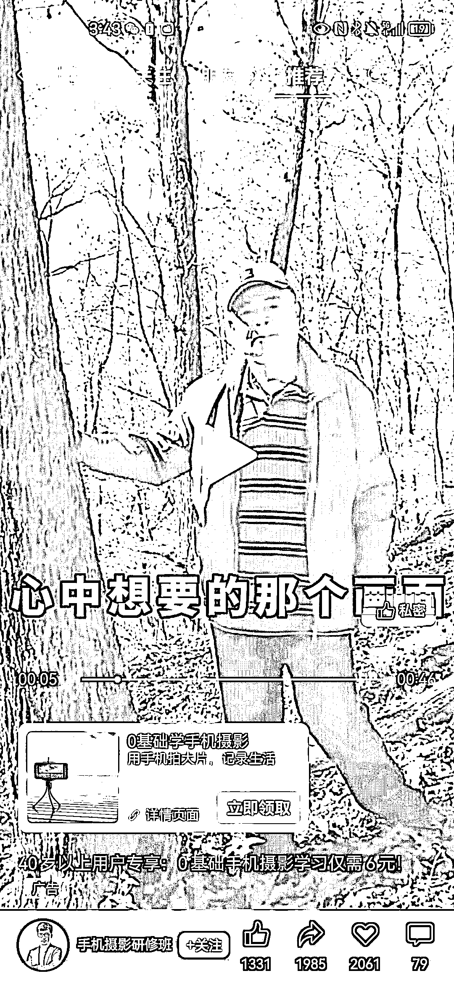

# 银发经济不仅仅有买好物的需求，还有学习、兴趣的需求

> 原文：[`www.yuque.com/for_lazy/xkrm14/dnmozn1p2tlxnvt3`](https://www.yuque.com/for_lazy/xkrm14/dnmozn1p2tlxnvt3)

<ne-p id="u7ad96dd6" data-lake-id="u7ad96dd6"><ne-text id="u5976a548">作者： 王大诗</ne-text></ne-p> <ne-p id="u549c75fe" data-lake-id="u549c75fe"><ne-text id="ua3e75b5e">日期：2023-04-04</ne-text></ne-p> <ne-p id="u3edf2031" data-lake-id="u3edf2031"><ne-text id="ucd4af108">点赞数：</ne-text><ne-text id="u0cfec669" ne-bold="true">30</ne-text></ne-p> <ne-hole id="u0f55799b" data-lake-id="u0f55799b"><ne-card data-card-name="hr" data-card-type="block" id="Tpe8h" data-event-boundary="card"><ne-p id="u146fb591" data-lake-id="u146fb591"><ne-text id="ua95e1628">正文：</ne-text></ne-p> <ne-p id="u7e9ad8d0" data-lake-id="u7e9ad8d0"><ne-text id="u671d3583">银发经济不仅仅有买好物的需求，还有学习、兴趣的需求。 刚刷到投放的《老年人手机摄影课》，这种操作对圈友应该不难。 课程方面：网上一大堆自己抄抄改改就可以了。</ne-text> <ne-text id="uac1eea19">投放方面：多找点点赞多的素材改改，再去投放就可以了。</ne-text></ne-p> <ne-p id="u8de2b83d" data-lake-id="u8de2b83d"><ne-card data-card-name="image" data-card-type="inline" id="kuXHP" data-event-boundary="card"></ne-card></ne-p> <ne-p id="u992f8de2" data-lake-id="u992f8de2"><ne-card data-card-name="image" data-card-type="inline" id="oDWJN" data-event-boundary="card"></ne-card></ne-p> <ne-hole id="u1fbee30b" data-lake-id="u1fbee30b"><ne-card data-card-name="hr" data-card-type="block" id="zSzx7" data-event-boundary="card"><ne-p id="u1b9bf1ed" data-lake-id="u1b9bf1ed"><ne-text id="uc0697613">评论区：</ne-text></ne-p> <ne-p id="u5fe9f714" data-lake-id="u5fe9f714"><ne-text id="ucbc92ead">暂无评论</ne-text></ne-p> <ne-hole id="u5637020e" data-lake-id="u5637020e"><ne-card data-card-name="hr" data-card-type="block" id="pykiO" data-event-boundary="card"><ne-p id="ub0c057c3" data-lake-id="ub0c057c3"><ne-text id="u6037ef64">公众号懒人找资源，懒人专属群分享</ne-text></ne-p></ne-card></ne-hole></ne-card></ne-hole></ne-card></ne-hole>