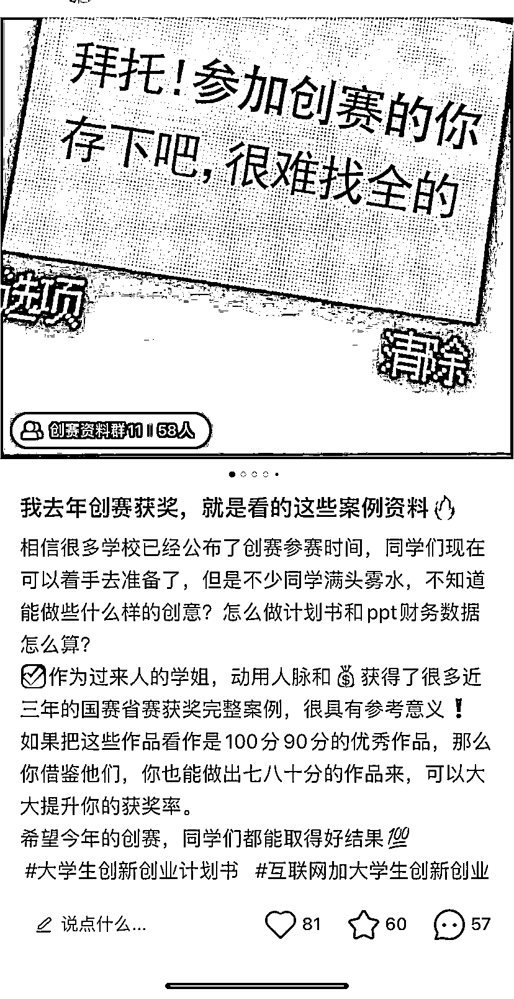
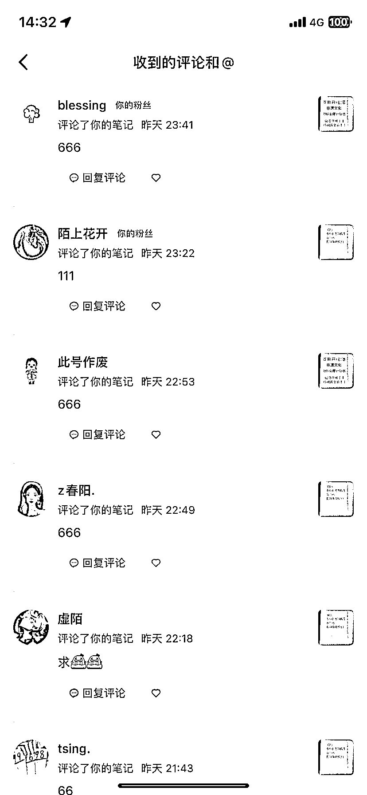

# 大学创新创业大赛比较蓝海的赛道，4～6 月是旺季

> 原文：[`www.yuque.com/for_lazy/xkrm14/nvq542pfvh3kgla7`](https://www.yuque.com/for_lazy/xkrm14/nvq542pfvh3kgla7)

<ne-p id="u0c3b57ae" data-lake-id="u0c3b57ae"><ne-text id="u3f826deb">作者： 丹枫</ne-text></ne-p> <ne-p id="u4d8eafe3" data-lake-id="u4d8eafe3"><ne-text id="u972676a0">日期：2023-04-04</ne-text></ne-p> <ne-p id="uadc81927" data-lake-id="uadc81927"><ne-text id="u60e768c6">点赞数：</ne-text><ne-text id="ud4503273" ne-bold="true">32</ne-text></ne-p> <ne-hole id="u09f4da4d" data-lake-id="u09f4da4d"><ne-card data-card-name="hr" data-card-type="block" id="t2vUn" data-event-boundary="card"><ne-p id="u78b26904" data-lake-id="u78b26904"><ne-text id="ua340c538">正文：</ne-text></ne-p> <ne-p id="ua1dd2c75" data-lake-id="ua1dd2c75"><ne-text id="u15426d04">大学创新创业大赛比较蓝海的赛道，4～6 月是这个赛道的旺季，可以卖一些创赛计划书相关的虚拟资料～</ne-text></ne-p> <ne-p id="ud8b1b830" data-lake-id="ud8b1b830"><ne-card data-card-name="image" data-card-type="inline" id="W9oNa" data-event-boundary="card"></ne-card></ne-p> <ne-p id="ue51e2824" data-lake-id="ue51e2824"><ne-card data-card-name="image" data-card-type="inline" id="YRHIs" data-event-boundary="card"></ne-card></ne-p> <ne-hole id="u502896ff" data-lake-id="u502896ff"><ne-card data-card-name="hr" data-card-type="block" id="Ym6NX" data-event-boundary="card"><ne-p id="u1cbe4fe4" data-lake-id="u1cbe4fe4"><ne-text id="ue0e7ec5d">评论区：</ne-text></ne-p> <ne-p id="ub36f7828" data-lake-id="ub36f7828"><ne-text id="u66de2449">暂无评论</ne-text></ne-p> <ne-hole id="uc35dfbb3" data-lake-id="uc35dfbb3"><ne-card data-card-name="hr" data-card-type="block" id="s495i" data-event-boundary="card"><ne-p id="uc1091eaa" data-lake-id="uc1091eaa"><ne-text id="u5d0925b4">公众号懒人找资源，懒人专属群分享</ne-text></ne-p></ne-card></ne-hole></ne-card></ne-hole></ne-card></ne-hole>