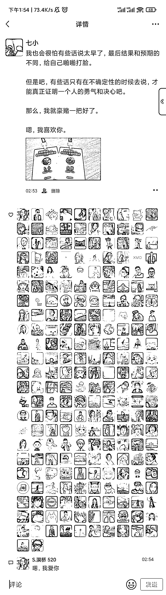
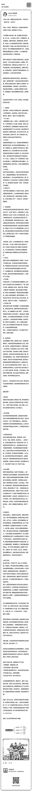

# 生财拉新的时候可以用上“对象”素材

> 原文：[`www.yuque.com/for_lazy/xkrm14/vg89mckdwrnm88tl`](https://www.yuque.com/for_lazy/xkrm14/vg89mckdwrnm88tl)

<ne-p id="uacf30ab3" data-lake-id="uacf30ab3"><ne-text id="u760b2e07">作者： 七小</ne-text></ne-p> <ne-p id="ucd4e8768" data-lake-id="ucd4e8768"><ne-text id="u090b3593">日期：2023-04-04</ne-text></ne-p> <ne-p id="u4fd89fbd" data-lake-id="u4fd89fbd"><ne-text id="uf91fbc18">点赞数：</ne-text><ne-text id="uceea1975" ne-bold="true">84</ne-text></ne-p> <ne-hole id="u0825c1c0" data-lake-id="u0825c1c0"><ne-card data-card-name="hr" data-card-type="block" id="OHILu" data-event-boundary="card"><ne-p id="ua704f790" data-lake-id="ua704f790"><ne-text id="u96c2ad3e">正文：</ne-text></ne-p> <ne-p id="u4d63f137" data-lake-id="u4d63f137"><ne-text id="ue305c5dc">有很多人问，进了生财之后，发不发对象？ 我说：发的。我举几个例子🌝 生财拉新的时候可以用上这个素材，哈哈哈</ne-text></ne-p> <ne-p id="ud9b2660d" data-lake-id="ud9b2660d"><ne-card data-card-name="image" data-card-type="inline" id="BfSfp" data-event-boundary="card"></ne-card></ne-p> <ne-p id="uc9d351aa" data-lake-id="uc9d351aa"><ne-card data-card-name="image" data-card-type="inline" id="MBl2w" data-event-boundary="card"></ne-card></ne-p> <ne-p id="ucd81fdaa" data-lake-id="ucd81fdaa"><ne-card data-card-name="image" data-card-type="inline" id="fkIfn" data-event-boundary="card"></ne-card></ne-p> <ne-p id="uf86daea7" data-lake-id="uf86daea7"><ne-card data-card-name="image" data-card-type="inline" id="s9TPA" data-event-boundary="card"></ne-card></ne-p> <ne-p id="u50bc6e24" data-lake-id="u50bc6e24"><ne-card data-card-name="image" data-card-type="inline" id="cLBWf" data-event-boundary="card"></ne-card></ne-p> <ne-hole id="ue844c68f" data-lake-id="ue844c68f"><ne-card data-card-name="hr" data-card-type="block" id="C3Rb1" data-event-boundary="card"><ne-p id="ua3458b13" data-lake-id="ua3458b13"><ne-text id="u6d32655b">评论区：</ne-text></ne-p> <ne-p id="u85b56329" data-lake-id="u85b56329"><ne-text id="u833d49d2">公号【张可粒 】 : 前排嗑 cp</ne-text></ne-p> <ne-p id="u07b9e5f5" data-lake-id="u07b9e5f5"><ne-text id="u81de2bc1">阿狸 : 只要不放弃，总会发到我</ne-text></ne-p> <ne-p id="u0e0af401" data-lake-id="u0e0af401"><ne-text id="ud9d6db00">七小 : 会的～</ne-text></ne-p> <ne-p id="uf10066f3" data-lake-id="uf10066f3"><ne-text id="ua92326c1">施霖终生学习者-链接 : 祝福有情人终成眷属， 祝福有钱人幸福快乐，</ne-text></ne-p> <ne-p id="u7c00d855" data-lake-id="u7c00d855"><ne-text id="u76f0115f">莲深 : 我真的会磕上头</ne-text></ne-p> <ne-p id="u7b2efb37" data-lake-id="u7b2efb37"><ne-text id="u3d28ac66">枕棠 : 前排磕糖</ne-text></ne-p> <ne-p id="u066e205e" data-lake-id="u066e205e"><ne-text id="ufd5423ad">诗农 Hope : 来晚了来晚了</ne-text></ne-p> <ne-p id="u9221d153" data-lake-id="u9221d153"><ne-text id="ub2a6aa20">如也 : 七小好勇敢啊！</ne-text></ne-p> <ne-hole id="u5cae305e" data-lake-id="u5cae305e"><ne-card data-card-name="hr" data-card-type="block" id="KnEdL" data-event-boundary="card"><ne-p id="u66a3b822" data-lake-id="u66a3b822"><ne-text id="ub70c86ca">公众号懒人找资源，懒人专属群分享</ne-text></ne-p></ne-card></ne-hole></ne-card></ne-hole></ne-card></ne-hole>