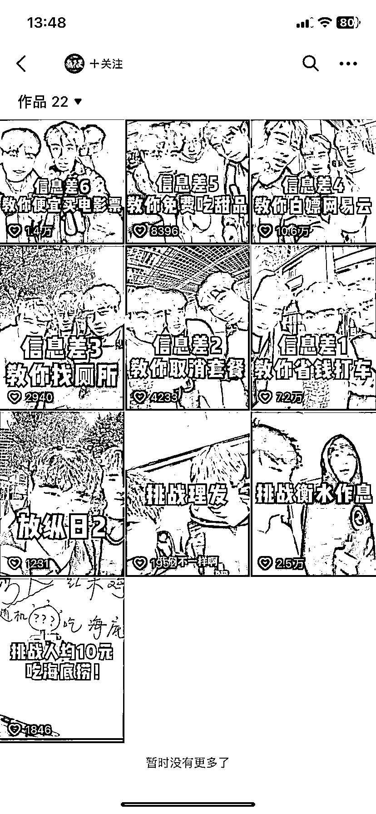

# 典型的跨平台选题搬运案例

> 原文：[`www.yuque.com/for_lazy/xkrm14/mk7nk3hua12klv70`](https://www.yuque.com/for_lazy/xkrm14/mk7nk3hua12klv70)

<ne-p id="u26289abd" data-lake-id="u26289abd"><ne-text id="u5e318595">作者： Believer</ne-text></ne-p> <ne-p id="uaf14bdbf" data-lake-id="uaf14bdbf"><ne-text id="u0a2db8e4">日期：2023-04-04</ne-text></ne-p> <ne-p id="u820e44ca" data-lake-id="u820e44ca"><ne-text id="u01ddf7e9">点赞数：</ne-text><ne-text id="ua75f9dcd" ne-bold="true">44</ne-text></ne-p> <ne-hole id="u90c6d889" data-lake-id="u90c6d889"><ne-card data-card-name="hr" data-card-type="block" id="vnuEI" data-event-boundary="card"><ne-p id="uc0f3569f" data-lake-id="uc0f3569f"><ne-text id="u7a126dac">正文：</ne-text></ne-p> <ne-p id="u618e7b58" data-lake-id="u618e7b58"><ne-text id="u740afb63">案例拆解 1、为什么拆解拆解这个案例？</ne-text> <ne-text id="ua56b6267">我刷到的时候眼前一亮，这个是典型的跨平台选题搬运，把小红书的热门话题搬来抖音做成视频。事实证明，热门话题放在哪里都是热门，拆解的原因是可复制性极强，难度低，天花板高，如图二，这个账号之前数据平平，从转换小红书信息差选题</ne-text> <ne-text id="u38641df9">后，流量一直走高，有起号成功的趋势 2、这个案例是什么 把小红书热门话题做成视频 符合“把文字转图文，把图文转视频”</ne-text> <ne-text id="ufa108699">从公众号到抖音视频，再到直播，视觉效果越来越直接，越直接也就越容易爆。 3、我们怎么复制？ 很多小伙伴自身都有业务的 如程序员可以写，“it 行业的信息差”</ne-text> <ne-text id="u18e2e062">做装修的可以写，“装修行业的信息差” 做 Chatgpt 可以写，“gpt4 的信息差”</ne-text></ne-p> <ne-p id="uaa69bb14" data-lake-id="uaa69bb14"><ne-card data-card-name="image" data-card-type="inline" id="AJove" data-event-boundary="card"></ne-card></ne-p> <ne-p id="u296d84fa" data-lake-id="u296d84fa"><ne-card data-card-name="image" data-card-type="inline" id="lquOX" data-event-boundary="card"></ne-card></ne-p> <ne-hole id="ud74c87a8" data-lake-id="ud74c87a8"><ne-card data-card-name="hr" data-card-type="block" id="ZCOn9" data-event-boundary="card"><ne-p id="uabf0a156" data-lake-id="uabf0a156"><ne-text id="u6136c9bd">评论区：</ne-text></ne-p> <ne-p id="ue447c9e6" data-lake-id="ue447c9e6"><ne-text id="u3404ee4a">lydia : 但后续怎么变现</ne-text></ne-p> <ne-p id="u75392965" data-lake-id="u75392965"><ne-text id="u0cecb1d6">Believer : 这种内容植入软广不要太简单，例如“你不知道怎么便宜吃海底捞？”然后推广金主的服务</ne-text></ne-p> <ne-p id="u6e24d964" data-lake-id="u6e24d964"><ne-text id="u36a17dbf">风不度 : 这个确实不错，小红书也总刷到这个</ne-text></ne-p> <ne-hole id="uaed87f9d" data-lake-id="uaed87f9d"><ne-card data-card-name="hr" data-card-type="block" id="b212B" data-event-boundary="card"><ne-p id="ucd2bca6a" data-lake-id="ucd2bca6a"><ne-text id="u9aa29eac">公众号懒人找资源，懒人专属群分享</ne-text></ne-p></ne-card></ne-hole></ne-card></ne-hole></ne-card></ne-hole>