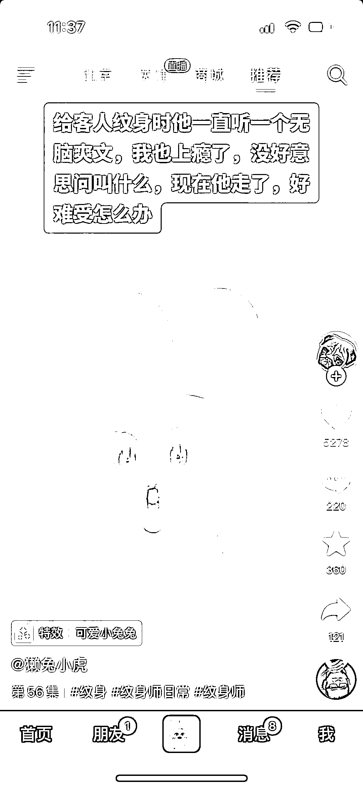

# 一种新的小说推文方式

> 原文：[`www.yuque.com/for_lazy/xkrm14/acwt8xidu66y19za`](https://www.yuque.com/for_lazy/xkrm14/acwt8xidu66y19za)

作者： 宋词

日期：2023-04-04

点赞数：24

<ne-hole id="u65288732" data-lake-id="u65288732"><ne-card data-card-name="hr" data-card-type="block" id="UEPMW" data-event-boundary="card">

正文：

一种新的小说推文方式

<ne-card data-card-name="image" data-card-type="inline" id="HgVUK" data-event-boundary="card"></ne-card>

<ne-card data-card-name="image" data-card-type="inline" id="oB2Fx" data-event-boundary="card"></ne-card>

<ne-hole id="u2cc7a6bb" data-lake-id="u2cc7a6bb"><ne-card data-card-name="hr" data-card-type="block" id="jTFT5" data-event-boundary="card">

评论区：

Mark_Hsu : 你好，我这边做校企合作有大量学生人力，变现项目可以合作聊聊吗？

宋词 : 你好呀~我目前没有做这个板块，可以在问题求助区和其他圈友了解一下看看

<ne-hole id="ud2c424eb" data-lake-id="ud2c424eb"><ne-card data-card-name="hr" data-card-type="block" id="BhWOk" data-event-boundary="card">

公众号懒人找资源，懒人专属群分享

</ne-card></ne-hole></ne-card></ne-hole></ne-card></ne-hole>