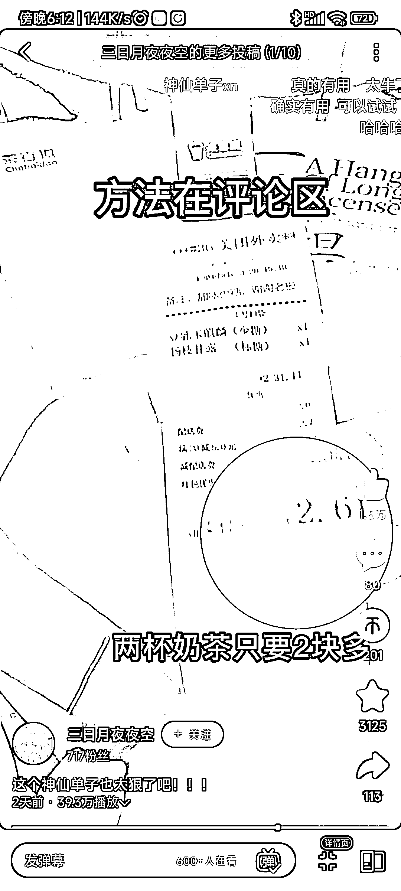
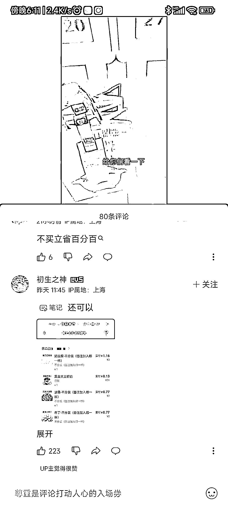

# B 站上发现很多用外卖价格单对比做视频来引流，播放量非常可观

> 原文：[`www.yuque.com/for_lazy/xkrm14/yypvz4bcomsvyure`](https://www.yuque.com/for_lazy/xkrm14/yypvz4bcomsvyure)

作者： 张老师

日期：2023-04-03

点赞数：28

<ne-hole id="udf31a110" data-lake-id="udf31a110">

正文：

B 站上发现用外卖员手中的外卖价格单对比做视频来引流做外卖 cps 的，并且在评论区有做引导的，播放量非常可观，博主主页也都是这种类型的。 针对播放量高的解读： B 站用户精准，以价格单为噱头，吸引眼球，评论区作秀有助于扩大宣传，影响转化率~ 做外卖 cps 的圈友可以尝试一下，就和之前在 B 站上做购物 cps 的一样~

<ne-hole id="u1fd4ea1b" data-lake-id="u1fd4ea1b">

评论区：

暂无评论

<ne-hole id="u1d51f22e" data-lake-id="u1d51f22e">

公众号懒人找资源，懒人专属群分享

</ne-hole></ne-hole></ne-hole>