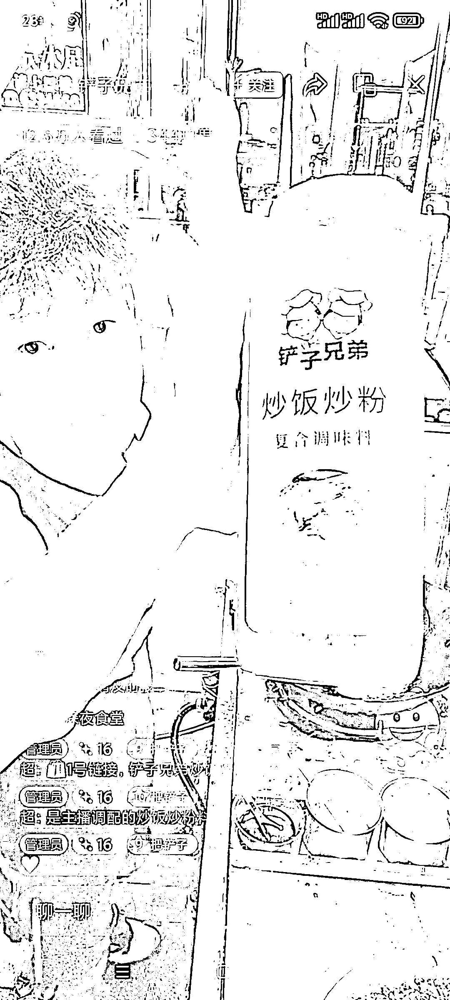
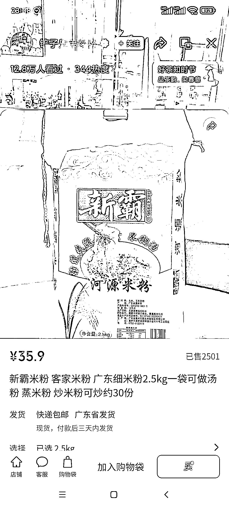

# 线下实体门店可以做街头炒粉炒饭直播

> 原文：[`www.yuque.com/for_lazy/xkrm14/hnxml34g4vbueexl`](https://www.yuque.com/for_lazy/xkrm14/hnxml34g4vbueexl)

<ne-p id="u789b4a2a" data-lake-id="u789b4a2a"><ne-text id="u585381a0">作者： 阿黎</ne-text></ne-p> <ne-p id="u6beb9951" data-lake-id="u6beb9951"><ne-text id="u0f15f6ec">日期：2023-04-03</ne-text></ne-p> <ne-p id="uc3d0c739" data-lake-id="uc3d0c739"><ne-text id="ub5017d54">点赞数：</ne-text><ne-text id="ub1456318" ne-bold="true">20</ne-text></ne-p> <ne-hole id="u3a922269" data-lake-id="u3a922269"><ne-card data-card-name="hr" data-card-type="block" id="PFBFF" data-event-boundary="card"><ne-p id="ucc7776a8" data-lake-id="ucc7776a8"><ne-text id="ud6a1c6d4">正文：</ne-text></ne-p> <ne-p id="u7786ef6c" data-lake-id="u7786ef6c"><ne-text id="uf38f1f90">视频号连续刷到几个炒饭炒粉的直播 街头炒粉炒饭 直播，有很大流量 1 做实体生意同时，卖货，比如卖米粉，卖配料</ne-text> <ne-text id="ue13e4b0c">比如图 1-4，主播说，我炒了 7 年米粉，用了上百种米粉，就是这个牌子米粉好吃，信我；这是我研制的独门调味料，炒粉就用它 2 靠打赏 3 收徒，加盟</ne-text> <ne-text id="uf835a001">4 通过线上，放大自己线下生意 实体生意的，都可以直播，满足人们窥探欲，参与感，体验城市烟火气，解压</ne-text></ne-p> <ne-p id="ua5c483d4" data-lake-id="ua5c483d4"><ne-card data-card-name="image" data-card-type="inline" id="ObP0q" data-event-boundary="card"></ne-card></ne-p> <ne-p id="udc361e12" data-lake-id="udc361e12"><ne-card data-card-name="image" data-card-type="inline" id="y5vrA" data-event-boundary="card"></ne-card></ne-p> <ne-p id="uc563e4a4" data-lake-id="uc563e4a4"><ne-card data-card-name="image" data-card-type="inline" id="VN1By" data-event-boundary="card"></ne-card></ne-p> <ne-p id="ucfa08d82" data-lake-id="ucfa08d82"><ne-card data-card-name="image" data-card-type="inline" id="fpEED" data-event-boundary="card"></ne-card></ne-p> <ne-p id="ue449d3b4" data-lake-id="ue449d3b4"><ne-card data-card-name="image" data-card-type="inline" id="nt6rV" data-event-boundary="card"></ne-card></ne-p> <ne-p id="uc454a105" data-lake-id="uc454a105"><ne-card data-card-name="image" data-card-type="inline" id="H3leN" data-event-boundary="card"></ne-card></ne-p> <ne-hole id="uaf16601b" data-lake-id="uaf16601b"><ne-card data-card-name="hr" data-card-type="block" id="CWUPU" data-event-boundary="card"><ne-p id="u02bcb8af" data-lake-id="u02bcb8af"><ne-text id="ufc74adb8">评论区：</ne-text></ne-p> <ne-p id="u4f91247b" data-lake-id="u4f91247b"><ne-text id="u8e42b5cb">暂无评论</ne-text></ne-p> <ne-hole id="ue08e1d62" data-lake-id="ue08e1d62"><ne-card data-card-name="hr" data-card-type="block" id="Rsarl" data-event-boundary="card"><ne-p id="u04c5a4ad" data-lake-id="u04c5a4ad"><ne-text id="u426f389d">公众号懒人找资源，懒人专属群分享</ne-text></ne-p></ne-card></ne-hole></ne-card></ne-hole></ne-card></ne-hole>