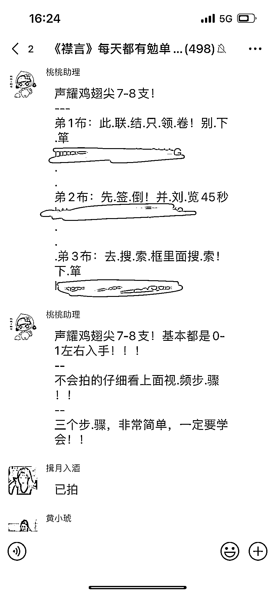

# 微信，用户 0 元购，淘客赚佣金，商家冲销量

> 原文：[`www.yuque.com/for_lazy/xkrm14/ncsrg2o8z551mb9w`](https://www.yuque.com/for_lazy/xkrm14/ncsrg2o8z551mb9w)

作者： 🐰兔子鱼🐟

日期：2023-04-07

点赞数：47

<ne-hole id="u8e504380" data-lake-id="u8e504380"><ne-card data-card-name="hr" data-card-type="block" id="oixMo" data-event-boundary="card">

正文：

“用户 0 元购，淘客赚佣金，商家冲销量” 因为喜欢薅羊毛朋友巧合下把我拉进某个 0 元购群，和淘客群可以自己转链分享不同，这个需要点链接被识别在群里才能查看信息，并且无法转链变成自己的，只能通过他们才能下单 0 元购一单大概淘客佣金 0.13 或者 0.5 左右都有可能，极少成多几百单也有百来块了，主要对用户而言，只要 0 元我就是省了就行 不过我薅羊毛多年也是第一次看到要被识别在群里的链接（反之则是发给其他人无权查看），不知道这块是如何实现的🤔 这种方式淘客保护了自己的单子，用户白嫖，商家有了销量，三全其美

<ne-card data-card-name="image" data-card-type="inline" id="cqJHl" data-event-boundary="card"></ne-card>

<ne-card data-card-name="image" data-card-type="inline" id="zxAJZ" data-event-boundary="card"></ne-card>

<ne-card data-card-name="image" data-card-type="inline" id="OgiON" data-event-boundary="card"></ne-card>

<ne-hole id="ufe6b5d1c" data-lake-id="ufe6b5d1c"><ne-card data-card-name="hr" data-card-type="block" id="WWotr" data-event-boundary="card">

评论区：

🐰兔子鱼🐟 : 不拉人啊不拉人 就是分享一下 如果有大神知道怎么做到这样保护自己的单子也希望可以得到解答[大哭]

智诚 : 想做，有圈友做的嘛

明月几时有 : 这个配合快递驿站拉群的话简直完美

等月的树 : 想做，有大佬知道怎么搞吗？

秋闯 : o 元购的从哪里来的信息渠道

🐰兔子鱼🐟 : 我也想知道

🐰兔子鱼🐟 : 也不能说信息渠道 应该是和商家合作 低价做销量的

饶同学 : 这种怎么做的啊 懂得圈友带带

<ne-hole id="u6bf7e8b2" data-lake-id="u6bf7e8b2"><ne-card data-card-name="hr" data-card-type="block" id="Kac8A" data-event-boundary="card">

公众号懒人找资源，懒人专属群分享

</ne-card></ne-hole></ne-card></ne-hole></ne-card></ne-hole>