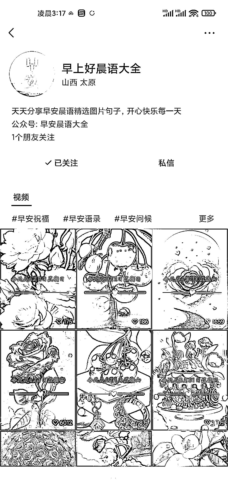

# 新榜查询视频号日榜异常值

> 原文：[`www.yuque.com/for_lazy/xkrm14/grfynow4oxim7eds`](https://www.yuque.com/for_lazy/xkrm14/grfynow4oxim7eds)

<ne-p id="uf25d5fe9" data-lake-id="uf25d5fe9"><ne-text id="u0f5360b5">作者： 老孙说经济</ne-text></ne-p> <ne-p id="udfb7ebf9" data-lake-id="udfb7ebf9"><ne-text id="uee4f06a1">日期：2023-04-03</ne-text></ne-p> <ne-p id="ud8fc9ceb" data-lake-id="ud8fc9ceb"><ne-text id="u5e1505d5">点赞数：</ne-text><ne-text id="ua9e7796d" ne-bold="true">28</ne-text></ne-p> <ne-hole id="u98f432af" data-lake-id="u98f432af"><ne-card data-card-name="hr" data-card-type="block" id="kcqCm" data-event-boundary="card"><ne-p id="u7cd63456" data-lake-id="u7cd63456"><ne-text id="u6f6412a1">正文：</ne-text></ne-p> <ne-p id="uf0890bf9" data-lake-id="uf0890bf9"><ne-text id="u80e55e43">新榜查询视频号日榜异常值。前 5 名中有 3 个都是早安语录（图一） 经过追源发现是同一个人的帐号，并且流量都不错，都绑定了公众号(图二），一鱼多吃</ne-text> <ne-text id="u36ca7fcf">仔细分析作品流量大的原因(图四图五) 1.视频内容为 ppt 图片，图片为 ai 出图，所以都是原创，没有限制 2.选题符合老人人群调性</ne-text> <ne-text id="ufb6324a6">3.音频内容是今天是 xxx 号星期 xx。送你 xxx 祝福各位 xxx，内容吸引人， 4.数量足够多，矩阵帐号 疑惑的地方</ne-text> <ne-text id="ub0ffcee2">如何进行变现了，流量是很大，都是送祝福的，卖挂历？</ne-text></ne-p> <ne-p id="u72ff6998" data-lake-id="u72ff6998"><ne-card data-card-name="image" data-card-type="inline" id="OQTH3" data-event-boundary="card">  <ne-p id="u5380a66e" data-lake-id="u5380a66e"><ne-card data-card-name="image" data-card-type="inline" id="TJi1k" data-event-boundary="card"></ne-card></ne-p> <ne-p id="u010678c5" data-lake-id="u010678c5"><ne-card data-card-name="image" data-card-type="inline" id="m8jRv" data-event-boundary="card"></ne-card></ne-p> <ne-p id="u97dd4c00" data-lake-id="u97dd4c00"><ne-card data-card-name="image" data-card-type="inline" id="henYI" data-event-boundary="card"></ne-card></ne-p> <ne-p id="u92223aa0" data-lake-id="u92223aa0"><ne-card data-card-name="image" data-card-type="inline" id="SbG7o" data-event-boundary="card"></ne-card></ne-p> <ne-hole id="ud992bbe8" data-lake-id="ud992bbe8"><ne-card data-card-name="hr" data-card-type="block" id="bbELU" data-event-boundary="card"><ne-p id="u5907cd51" data-lake-id="u5907cd51"><ne-text id="u96c42a61">评论区：</ne-text></ne-p> <ne-p id="u0be78cee" data-lake-id="u0be78cee"><ne-text id="u5f0cb473">骏马 : 流量主</ne-text></ne-p> <ne-p id="u659bee77" data-lake-id="u659bee77"><ne-text id="udad37c33">飞鸡壳壳 : 1.在推文里面插广告 2.文章底部广告 3.引流到小程序付费制作同款视频</ne-text></ne-p> <ne-hole id="ufe57fe36" data-lake-id="ufe57fe36"><ne-card data-card-name="hr" data-card-type="block" id="uQZh0" data-event-boundary="card"><ne-p id="u8566c1af" data-lake-id="u8566c1af"><ne-text id="u582a6b58">公众号懒人找资源，懒人专属群分享</ne-text></ne-p></ne-card></ne-hole></ne-card></ne-hole></ne-card></ne-p></ne-card></ne-hole>