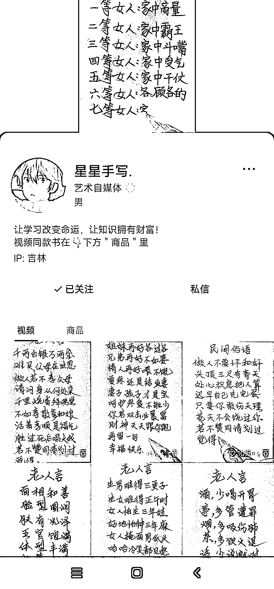
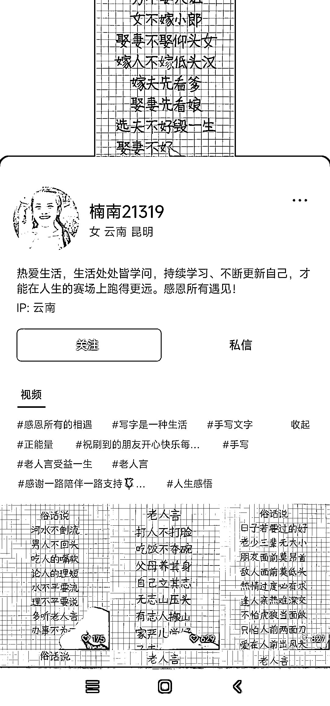

# 视频号上手写名人名言、情感文案等内容的帐号点赞量挺高

> 原文：[`www.yuque.com/for_lazy/xkrm14/odur2qqp9oclsi08`](https://www.yuque.com/for_lazy/xkrm14/odur2qqp9oclsi08)

<ne-p id="u3346ef41" data-lake-id="u3346ef41">作者： 振哥</ne-p> <ne-p id="u69c7dcb6" data-lake-id="u69c7dcb6">日期：2023-04-03</ne-p> <ne-p id="u879912be" data-lake-id="u879912be">点赞数：19</ne-p> <ne-hole id="u74c60228" data-lake-id="u74c60228"><ne-card data-card-name="hr" data-card-type="block" id="TyCPG" data-event-boundary="card"><ne-p id="ubed1ac8f" data-lake-id="ubed1ac8f">正文：</ne-p> <ne-p id="u615e7e21" data-lake-id="u615e7e21">视频号上这种手写名人名言、情感文案、励志文案等内容的帐号，点赞量还挺高。跟之前抖音上的玩法一样，变现方式是视频带货和直播带货。商店带货笔、字帖之类的，直播的时候会写按用户的要求写名字，提高互动，然后带货写字笔。</ne-p> <ne-p id="u42e067f1" data-lake-id="u42e067f1"><ne-card data-card-name="image" data-card-type="inline" id="pW9rB" data-event-boundary="card"></ne-card></ne-p> <ne-p id="u2f4f0ddf" data-lake-id="u2f4f0ddf"><ne-card data-card-name="image" data-card-type="inline" id="v7cDN" data-event-boundary="card"></ne-card></ne-p> <ne-p id="u43c5c0a0" data-lake-id="u43c5c0a0"><ne-card data-card-name="image" data-card-type="inline" id="WVT7e" data-event-boundary="card"></ne-card></ne-p> <ne-hole id="u660a6f8b" data-lake-id="u660a6f8b"><ne-card data-card-name="hr" data-card-type="block" id="BRxMk" data-event-boundary="card"><ne-p id="u17e77369" data-lake-id="u17e77369">评论区：</ne-p> <ne-p id="u52e5e1cc" data-lake-id="u52e5e1cc">大圣 : 我朋友开发了个软件 手写生成器有需要的可以联系他</ne-p> <ne-hole id="u80de1e88" data-lake-id="u80de1e88"><ne-card data-card-name="hr" data-card-type="block" id="rsAbR" data-event-boundary="card"><ne-p id="u7dd600b1" data-lake-id="u7dd600b1">公众号懒人找资源，懒人专属群分享</ne-p></ne-card></ne-hole></ne-card></ne-hole></ne-card></ne-hole>