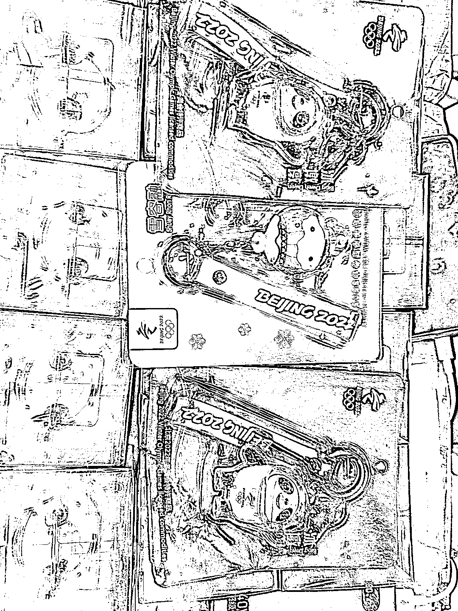
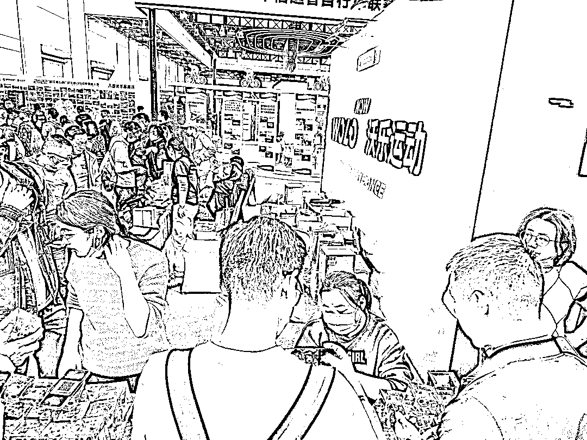

# 到大型展会线下拉新，流量好

> 原文：[`www.yuque.com/for_lazy/xkrm14/mkh1bwclnwf13qcu`](https://www.yuque.com/for_lazy/xkrm14/mkh1bwclnwf13qcu)

<ne-p id="u487e009b" data-lake-id="u487e009b"><ne-text id="u17b64bed">作者： 斑马森林</ne-text></ne-p> <ne-p id="u6d498f35" data-lake-id="u6d498f35"><ne-text id="ubc1f3ebe">日期：2023-04-07</ne-text></ne-p> <ne-p id="u0d84ea6f" data-lake-id="u0d84ea6f"><ne-text id="u8671f722">点赞数：</ne-text><ne-text id="u029526c4" ne-bold="true">75</ne-text></ne-p> <ne-hole id="ua9d2ff21" data-lake-id="ua9d2ff21"><ne-card data-card-name="hr" data-card-type="block" id="g67jp" data-event-boundary="card"><ne-p id="uedc7f138" data-lake-id="uedc7f138"><ne-text id="u5782ca8a">正文：</ne-text></ne-p> <ne-p id="u6c387754" data-lake-id="u6c387754"><ne-text id="ue266b1c6">上周末参加马拉松，领物资的时候，在展馆内有个“特殊的展位”，快手极速版拉新展位。</ne-text> <ne-text id="ua08939ce">展位的布置很简单，桌面摆满了拉新礼品冰墩墩（大到模型，小到钥匙扣），拉新人员大概有十来个人，每个人手上都拿着他们自己的拉新二维码。</ne-text> <ne-text id="u2b67451d">跟他们聊了会，他们是全国范围流动，主要看哪里大型展会就去哪里，比如马拉松或者博览会等，一天一个人能拉新 50 到 100 个左右，小团队 10 个人起，收益挺可观的。</ne-text> <ne-text id="ub476b2f1">今年开始，随着疫情放开，大型的赛事和展会都在陆续举办，这种活动有个特点就是场地密封，用户集中，不用自己找用户，拉新流程简单，奔着薅羊毛的心理，很多用户也愿意下载 App</ne-text></ne-p> <ne-p id="u4673ef6b" data-lake-id="u4673ef6b"><ne-card data-card-name="image" data-card-type="inline" id="SDm6j" data-event-boundary="card"></ne-card></ne-p> <ne-p id="ue1661411" data-lake-id="ue1661411"><ne-card data-card-name="image" data-card-type="inline" id="ICnXQ" data-event-boundary="card"></ne-card></ne-p> <ne-p id="ud842ceae" data-lake-id="ud842ceae"><ne-card data-card-name="image" data-card-type="inline" id="qUbHr" data-event-boundary="card"></ne-card></ne-p> <ne-p id="u37aecc83" data-lake-id="u37aecc83"><ne-card data-card-name="image" data-card-type="inline" id="duiDw" data-event-boundary="card"></ne-card></ne-p> <ne-p id="ubccb5468" data-lake-id="ubccb5468"><ne-card data-card-name="image" data-card-type="inline" id="bL8BJ" data-event-boundary="card"></ne-card></ne-p> <ne-hole id="u3b95daaa" data-lake-id="u3b95daaa"><ne-card data-card-name="hr" data-card-type="block" id="mTJEm" data-event-boundary="card"><ne-p id="ue2062001" data-lake-id="ue2062001"><ne-text id="ub2405af9">评论区：</ne-text></ne-p> <ne-p id="u474687c5" data-lake-id="u474687c5"><ne-text id="ue4c7bcd3">平凡不平凡 : 厦门的？？厦门有没有生财群？</ne-text></ne-p> <ne-p id="uaf0d128e" data-lake-id="uaf0d128e"><ne-text id="uaf0d861b">Aaron : 这种拉新一个有多少钱啊</ne-text></ne-p> <ne-p id="u4e6d316a" data-lake-id="u4e6d316a"><ne-text id="u39925a45">丘水伊 : 怎么联系他们？广西南宁 5 月有个大型活动 3 天 500 人想找赞助</ne-text></ne-p> <ne-p id="u551fa4cc" data-lake-id="u551fa4cc"><ne-text id="u0c6a9a3f">斑马森林 : 这是拉新团队，不是赞助商</ne-text></ne-p> <ne-p id="u04c04f31" data-lake-id="u04c04f31"><ne-text id="u41221306">文一 : 生财一般没有微信群噢，只有航海等实践活动才会拉群</ne-text></ne-p> <ne-p id="u4c53a02b" data-lake-id="u4c53a02b"><ne-text id="ub4f418ec">晴天哥哥 : 问问鱼丸～</ne-text></ne-p> <ne-p id="u1ac0a5dd" data-lake-id="u1ac0a5dd"><ne-text id="u0986e616">A 孟世扬 : 抖音极速 21，快手极速版 17 七留 42</ne-text></ne-p> <ne-p id="u4fd6d522" data-lake-id="u4fd6d522"><ne-text id="uf1d80c0f">A 孟世扬 : 要出摊位费的，厦门不知道，北京这么大位置至少几万块</ne-text></ne-p> <ne-hole id="u9c2c1b39" data-lake-id="u9c2c1b39"><ne-card data-card-name="hr" data-card-type="block" id="uZNK2" data-event-boundary="card"><ne-p id="uad6430d3" data-lake-id="uad6430d3"><ne-text id="u8dcc370d">公众号懒人找资源，懒人专属群分享</ne-text></ne-p></ne-card></ne-hole></ne-card></ne-hole></ne-card></ne-hole>