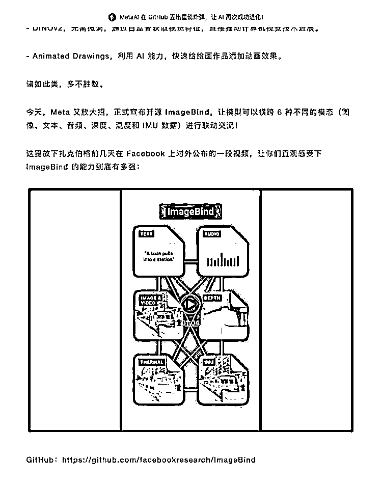

# MetaAI 在 GitHub 丢出重磅炸弹，让 AI 再次成功进化

> 原文：[`www.yuque.com/for_lazy/xkrm14/wpfb11vaysdm0okp`](https://www.yuque.com/for_lazy/xkrm14/wpfb11vaysdm0okp)

作者： D-

日期：2023-05-10

点赞数：48

正文：

MetaAI 的多模态能力，让 AI 更接近人类。 [MetaAI+在+GitHub+丢出重磅炸弹，让+AI+再次成功进化！](https://mp.weixin.qq.com/s/d6apZJDCLQ3RnluYzdBimA)

  

评论区：

