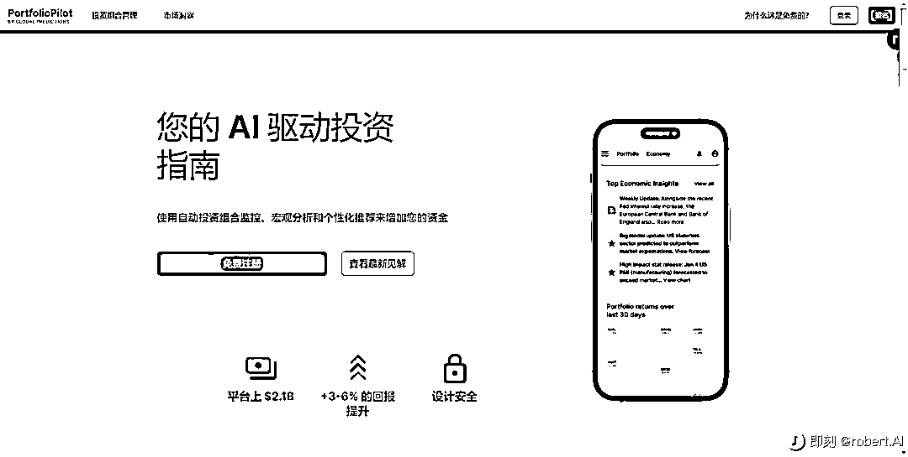

# AI 驱动投资指南

> 原文：[`www.yuque.com/for_lazy/xkrm14/cyiovukxx1f6o2ug`](https://www.yuque.com/for_lazy/xkrm14/cyiovukxx1f6o2ug)

作者： 🐵Sunday🐵

日期：2023-05-05

点赞数：45

正文：

AI 驱动投资指南 使用自动投资组合监控、宏观分析和个性化推荐来增加您的资金。 只需复制并粘贴您的投资组合，即可获得对您的投资组合的全面分析，并提供可操作的改进建议、行业和国家/地区细分等。 发现符合您标准的表现最佳的 ETF 和股票，按费用比率、地理位置、行业等进行过滤。轻松找到您的下一笔投资。 随时了解您感兴趣的公司和基金的最新财务信息！获取实时新闻、股票价格、财报电话会议日期、财务概况等。 及时获取有关美国、加拿大或全球经济的关键宏观见解摘要，保持领先地位。 加入 PortfolioPilot 插件警报邮件列表，监控经济并在机会或风险出现时通知您。 PS:注册时需使用电话号码，仅接受美国/加拿大电话号码 Web： [PortfolioPilot](https://portfoliopilot.com/)

评论区：

