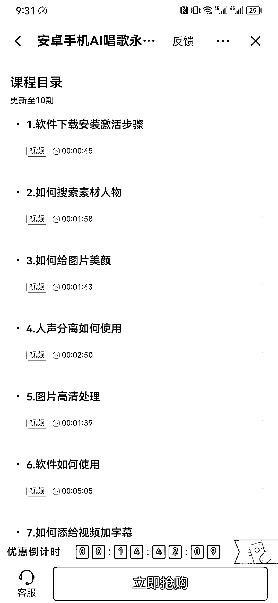

# 抖音销量很好的教人把照片变成唱歌视频，下沉市场细分有很大需求

> 原文：[`www.yuque.com/for_lazy/xkrm14/koizt13t3bpe70oh`](https://www.yuque.com/for_lazy/xkrm14/koizt13t3bpe70oh)

作者： do 小鱼

日期：2023-05-09

点赞数：91

正文：

教人把照片变成唱歌视频，抖音里面不起眼却销量很好的课程。开发课程的视频粉丝仅 1w，课程 10 节时长总共不到 20 分钟，销售额 40w+。下沉市场把一个细分做好都有很大的需求。

评论区：

BLUE : 这也行？

星火燎原 : 处处都是机会[强]， 只有不赚钱的人， 没有不赚钱的行业。

苍述 : 想问下销售额你是怎么得到的呢

本自具足 : 真行啊 是

执着 : 用心观察，哪里都有机会。

eason. : 这里想问下 如何确定销量真实性 很多后台直接改的

do 小鱼 : 根据下面有一个 7070 人在学 推断的 不一定准确 大家可以自行去调研一下

