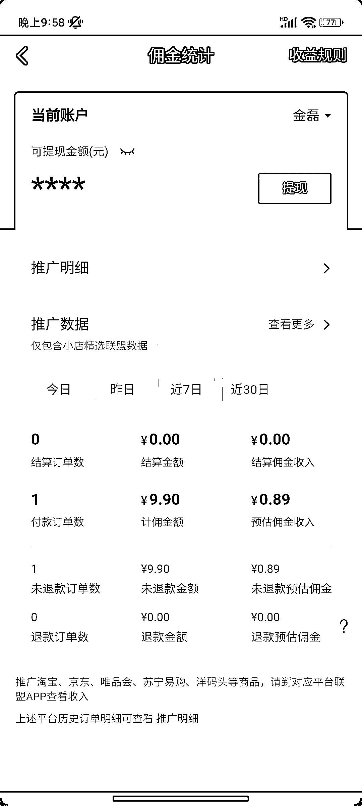

# 抖音目前部分账号可以 0 粉带货，只要实名＋人脸认证就可以加商品了

> 原文：[`www.yuque.com/for_lazy/xkrm14/ks12mcq5h9kqhukh`](https://www.yuque.com/for_lazy/xkrm14/ks12mcq5h9kqhukh)

作者： 二帮主

日期：2023-05-06

点赞数：100

正文：

前面看到有人说抖音可以 0 粉带货了 我有些账号还是显示要 1000 粉 今天找了一个账号发现 0 粉可以 实名＋人脸认证，然后要听下指定的课 橱窗就可以加商品了，也不要交 1000 自己小号买了一单，可以诶[色] 带货门槛大大降低，快去试试

评论区：

李雅雯 : 怎么操作的

不老什人 : 有没有限制一周只能短视频挂车一次

二帮主 : 我还没发视频，明天试试

二帮主 : 就直接点创作者中心，和原来一样

小安 : 需要新注册的账号吧

二帮主 : 我不是新注册的，几个月前注册的。它这个应该随机推的。还没全部推

水欣 : 试了，真的可以呀。谢谢[抱拳][抱拳]

二帮主 : 哈哈，不客气

公众号懒人找资源，懒人专属群分享

