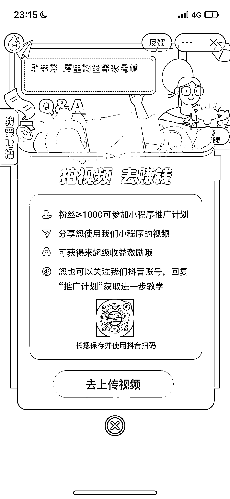

# 搭建小程序通过“测一测你对球星的了解有多少”广告变现

> 原文：[`www.yuque.com/for_lazy/xkrm14/no6006unrckc1ycg`](https://www.yuque.com/for_lazy/xkrm14/no6006unrckc1ycg)

作者： 剽悍的大春

日期：2023-05-04

点赞数：66

正文：

篮球🏀目前是世界上最受欢迎的运动之一，特别是在中国！ 一些篮球博主～有粉丝基础的！直接搭建一个小程序“测一测你对球星的了解有多少，让粉丝测试出成绩！这种对于粉丝来说，是一个很好的引子。也热衷于参与！ 变现途径:广告收入

评论区：

周彦充 : 小程序，推广，cps，抖音开始打微信的生态了

千穹 : 源码在哪里找

剽悍的大春 : 可以添加并关注类似博主的抖音号咨询

歪文 : 不错，直接引申到其他领域

剽悍的大春 : 这个可以引导很多领域:明星类、体育类、等等，都可以设置粉丝等级考试等，来赚取广告收益

公众号懒人找资源，懒人专属群分享

