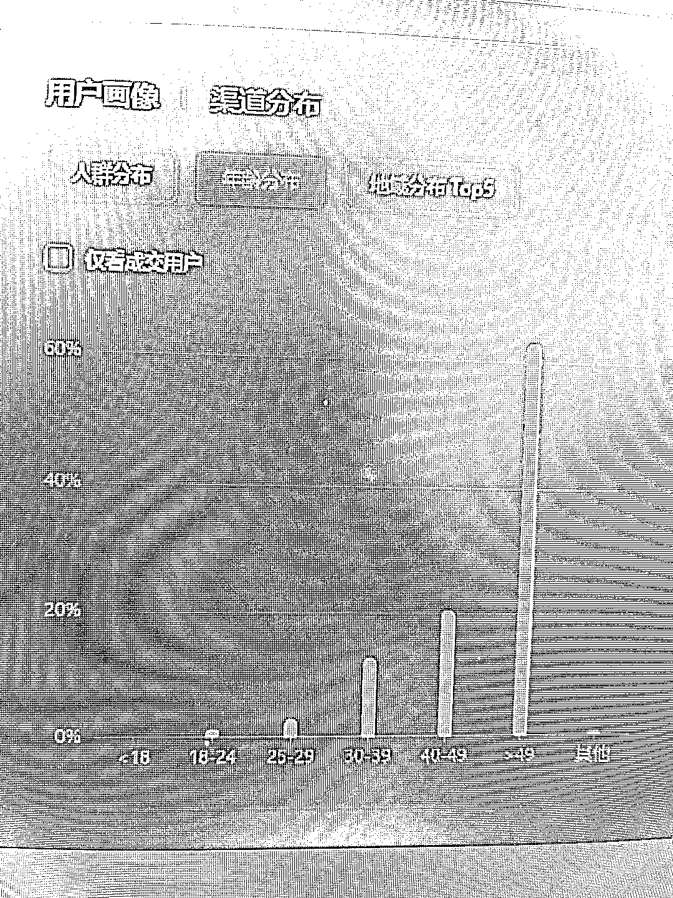

# 同类目在视频号和抖音直播差别很大

> 原文：[`www.yuque.com/for_lazy/xkrm14/ifny85vow8ct0frf`](https://www.yuque.com/for_lazy/xkrm14/ifny85vow8ct0frf)

作者： 先丰

日期：2023-05-05

点赞数：63

正文：

五一到现在视频号连续直播，发现人群跟抖音真的差别很大。同样类目抖音购买人群一般都是 30-39 这个区间最多，但是在视频号上明显 49 以上的最多，而且占比高达 62%。数据明显异常。 我已经准备换做老年人类目了，老年人消费能力强，引流到微信有复购，适合做私域。

评论区：

安哥拉 : 准备做什么

ES 大 E : 我也想知道，老人群体有什么适合普通人做的？适合他们，性价比高的

先丰 : 养生产品 准备做私域

安哥拉 : 很容易擦边哦

先丰 : 真正的产品放到私域里面

ﻩ真的阿牛 : 你做了哪些类目呀？有没有同样类目抖音和视频号的对比呀

先丰 : 我目前做的是日用家居类的

公众号懒人找资源，懒人专属群分享

