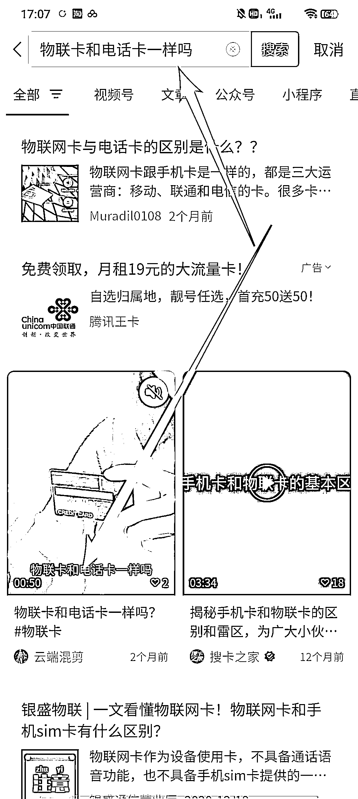
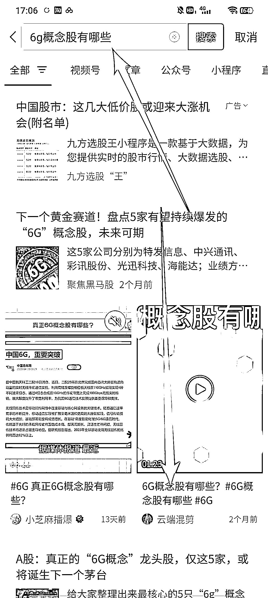

# 微信搜一搜优化排名包含哪些？

> 原文：[`www.yuque.com/for_lazy/xkrm14/zhid0p4x69ssnwsv`](https://www.yuque.com/for_lazy/xkrm14/zhid0p4x69ssnwsv)

作者： 一把菜刀【搜索引流】

日期：2023-05-04

点赞数：32

正文：

微信搜一搜优化排名包含哪些？ 1:公众号 2:视频号 3:小程序 4:视频号视频（这个很少有人知道，有很少有人玩） 公众号文章能不能优化？答案是很困难，一方面是因为公众号文章排名是千人千面展现，同步率不高，另外一方面做数据干预效果不理想，市面上目前缺量，懂的都懂 公众号 seo 优化排名 微信搜一搜

  

  

  

评论区：

xing : 不是有人专门做这个的吗，结合 ai，每天赚流量主

一把菜刀【搜索引流】 : 那个是发文章引流吧，我们做的是关键词排名

