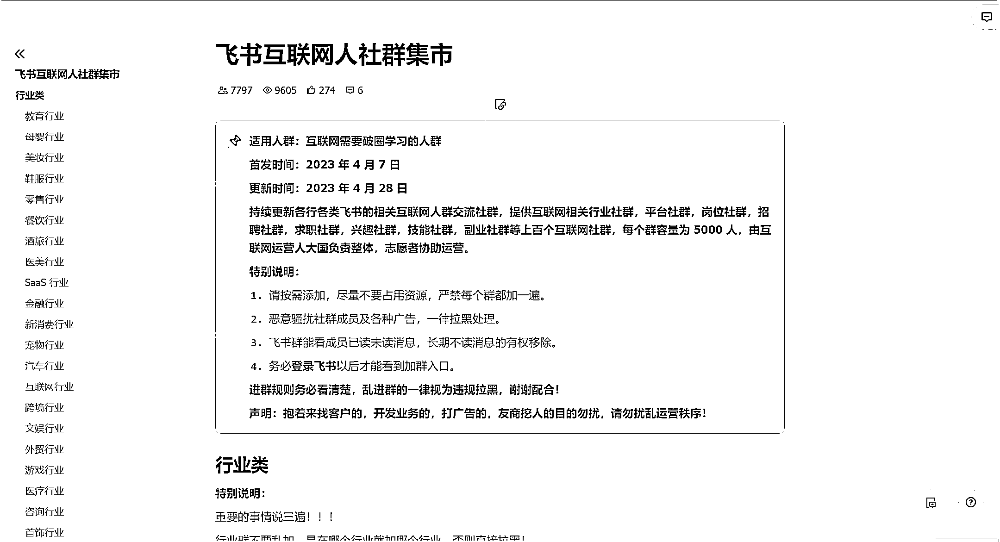

# 通过打造飞书免费交流群进而发展私域用户，可以说深挖

> 原文：[`www.yuque.com/for_lazy/xkrm14/gtty7s448atqzau5`](https://www.yuque.com/for_lazy/xkrm14/gtty7s448atqzau5)

作者： 翁广润

日期：2023-05-05

点赞数：33

正文：

通过打造飞书免费交流群进而发展私域用户 偶然下加了一些飞书群，发现的。。。 现在使用飞书的用户越来越多，而且都是在上班的用户，通过创建各行各业，各地各平台的免费交流群，这些用户要么专业对口，要么有创业或其他发展的需求，很容易被吸引加群，进去后发些行业内的新咨讯吸引大家讨论，然后缓几天后就开始推自己的付费社群。同时，群里会有一些用户有其他需求，如找人作图之类的，也是可以深挖的。

评论区：

蓝色鲸鱼梦 : 怎么加入呢

吾爱诗词 : 怎么加入飞书群啊，没找到[流泪]

