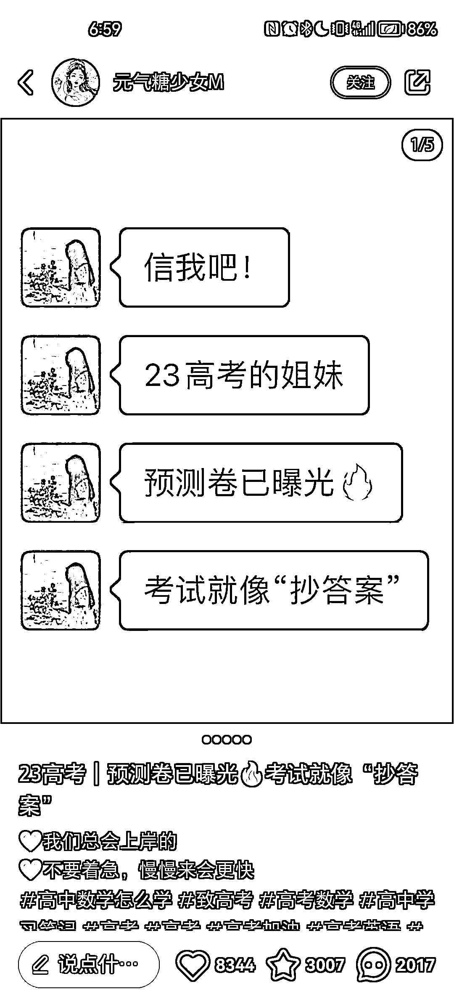
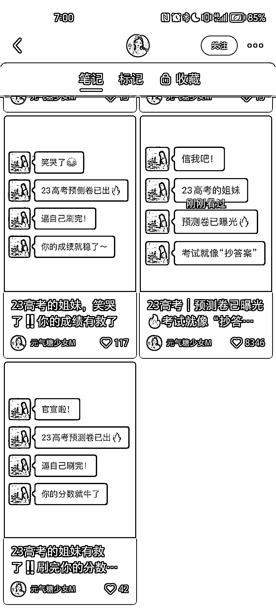
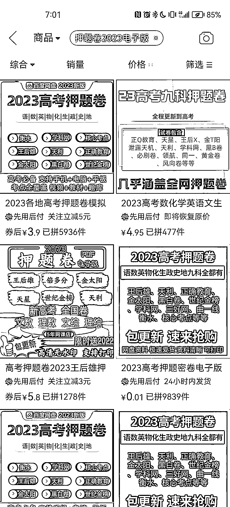

# 这段时间高考赛道的内容应该是最火的，可以引流

> 原文：[`www.yuque.com/for_lazy/xkrm14/mruq7vvpcd5xvpf6`](https://www.yuque.com/for_lazy/xkrm14/mruq7vvpcd5xvpf6)

作者： 拱卒

日期：2023-05-12

点赞数：150

正文：

高考赛道，这段时间，这类内容应该是最火的，没有之一，可以引流（还有不到一个月高考） 卖资料或者后续卖高考志愿填报卡 这是虚拟电商的内容，下面来说一些实物电商的干货 实物电商（小红书无货源电商）逻辑很简单，高考还有不到一个月，涉及高考的周边产品，可以重点考虑，不知道有什么周边产品的 可以在拼多多或者淘宝搜索关键词“高考”会出现很多热门产品 至于内容，最简单的肯定是二创抖音的，升级版，肯定还是自己的原创 小红书资料引流 小红书电商

  

  

评论区：

拱卒 : 当然还有很多创意玩法 例如 1.高考结束后，互赠礼物（可以在朋友圈灌输这个思想，其实本来也有） 2.高考相册精致本 3.高考升大学的知识付费产品 4.即将进入大学的时候，需要准备的软硬件物品 等等，很多 把私域玩明白了，可以整个用户生命周期，多纬度操作

浪人 : [鼓掌]

拱卒 : 冲

周彦充 : 高考指数开始飙升

拱卒 : 对

闫君 : 总觉得高考是影响一个人一辈子的事，咱不专业就别误导孩子了。尤其是看到那个什么信我吧的文案，这种人真的。。。。。

