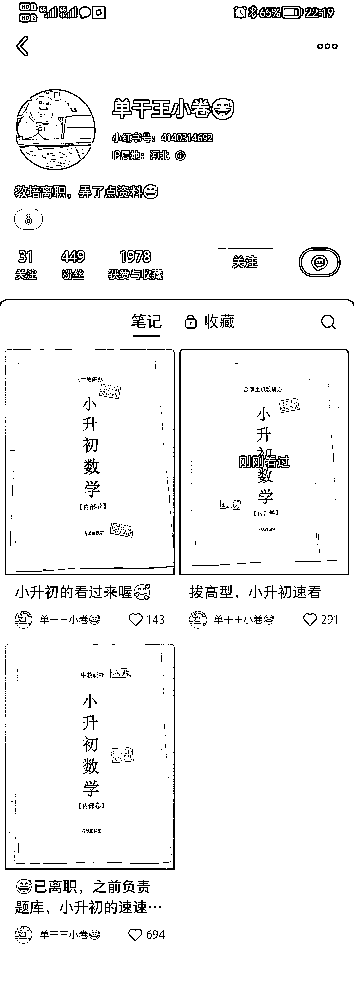

# 小红书资料引流，直接把资料打印出来然后实拍发就行

> 原文：[`www.yuque.com/for_lazy/xkrm14/cgwrwhzbgv3ve0tr`](https://www.yuque.com/for_lazy/xkrm14/cgwrwhzbgv3ve0tr)

作者： 豆豆

日期：2023-05-09

点赞数：100

正文：

小红书资料引流，直接把资料打印出来，然后实拍发就行，三个笔记起号

  

评论区：

闫君 : 数据挺好

张热烈啊 : 这个资料从哪里来呢

豆豆 : 很多人做虚拟资料项目呀，星球也很多贴的，你多搜搜

大胡 : 这个怎么引流到微信的？

豆豆 : 去看看小红书的航海资料，里面很多引流操作

大胡 : 最近试了很多，都限流了[捂脸]，能分享一下你的方法吗？

公众号懒人找资源，懒人专属群分享

