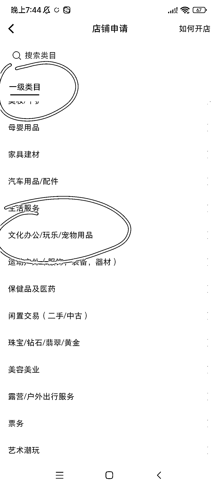
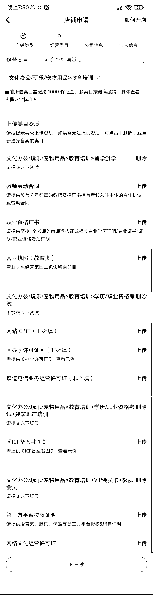

# 小红书可以上架课程、影视 VIP 会员卡，卖课程、卖影视会员卡了

> 原文：[`www.yuque.com/for_lazy/xkrm14/oczy5tholy16g1wt`](https://www.yuque.com/for_lazy/xkrm14/oczy5tholy16g1wt)

作者： 阿黎

日期：2023-05-08

点赞数：82

正文：

小红书可以上架课程、影视 VIP 会员卡，卖课程、卖影视会员卡了! 开通方法和类目（图 1—4） 在创作中心——更多服务——开通店铺 一级类目:文化办公——二级类目:教育培训——后续还有 3 级和 4 级类目可选 部分类目需要上传资质（图 5） 玩法更多，5 月大航海的福利啊! 冲!

  

  

  

  

  

评论区：

书虫¹ : 这个货源怎么搞呢，关于这个一直挺好奇的

张小悦 : 我的还是不可以啊，请问您是有营业执照吗？

阿黎 : 参加大航海

阿黎 : 不太明白，升级一下试试看，应该是大家都可以了

张小悦 : 我现在是小红书商家版最新的 APP 了，是苹果手机

张小悦 : 请问您开的小红书店铺是企业版还是个人版？

阿党 : 个体工商户可以

