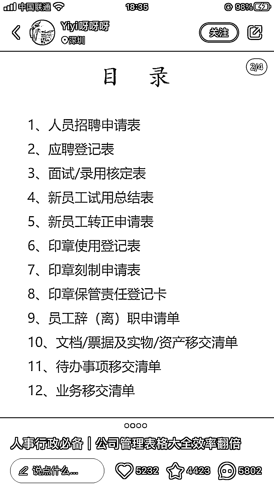
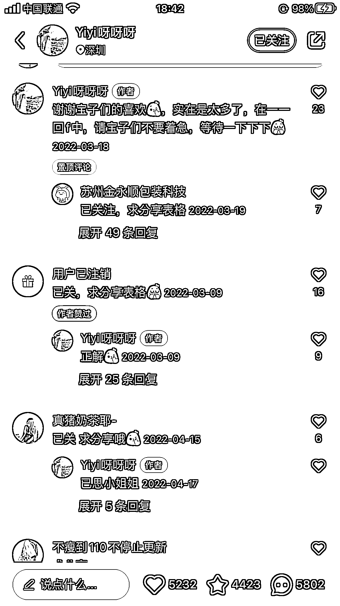
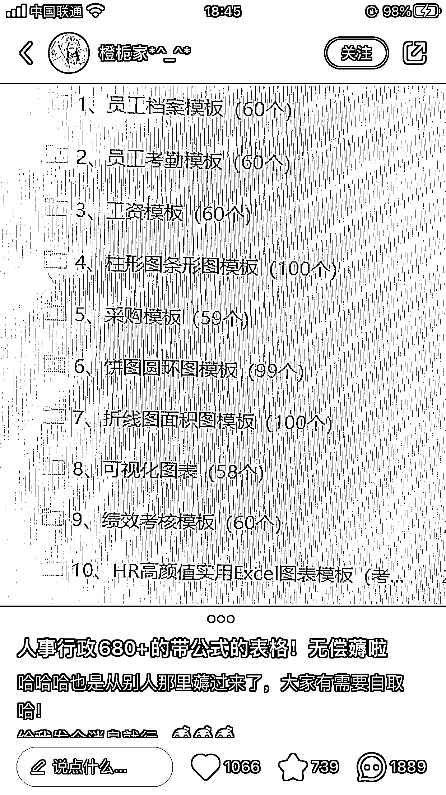
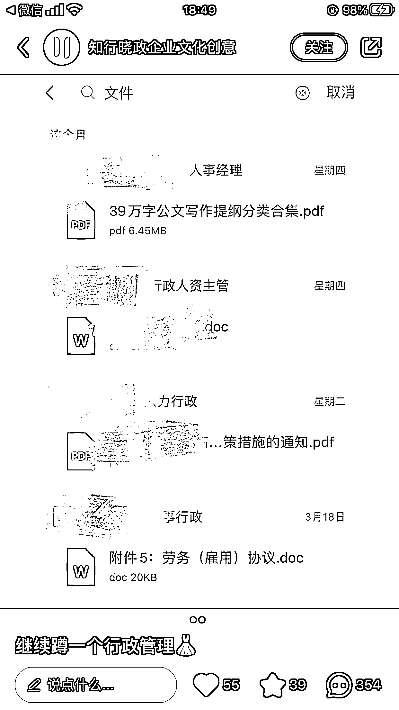

# 小红书低粉爆款引流合集、挖掘金矿

> 原文：[`www.yuque.com/for_lazy/xkrm14/sli0gukbm6zhye76`](https://www.yuque.com/for_lazy/xkrm14/sli0gukbm6zhye76)

作者： 随想

日期：2023-05-08

点赞数：40

正文：

小红书低粉爆款引流合集、挖掘金矿 【推荐理由】 1\. 引流效率高，低粉爆款；案例集合-》完整商业项目雏形； 1.1 有常规资料引流，也有特色引流：目录引流、通知模版引流、地区群引流 1.2 不仅仅是引流，其实已有全国拓展布局的基础了，你细品 1.3 “引流、转化、交付”，“一盘棋”来看这些案例。推演一下，就是一个非常好的 商业项目雏形 2.赛道好，长久可以做 2.1 行政赛道、hr 赛道是一个长期赛道，这个赛道足够广 2.2 这两个赛道的信息资源、新媒体素材足够多 2.3 这两个赛道可以对接很多商业资源，是一个离“钱”很近的赛道。比如说：办公 用品、办公室装修、人才招聘，等等 3.中后端可变现的方式比较多 3.1 常规卖资料类、行政人员培训、hr 人员培训 3.2 卖产品： 办公用品、礼品定制、行政福利采购，等 3.3 卖服务： 人才招聘、保洁绿植、灵活用工、企业服务、办公室装修、猎头服务、员工培 训、考证类，等 3.4 升级为区域互联网品牌： 基于前面三点中任意两点基础业务之上-》 “区域互联网企业服务平台”【某一 个地区、某一个城市】-》 “区域互联网本地生活服务平台”【某一个地区、某一 个城市】升级为全国业务拓展，走加盟连锁 3.5 在前面几点业务的基础上，拓展全国业务 4\. 0 成本，小白也能做 欢迎评论、留言，大家一块探讨 由于排版格式，具体详情和实操请见：[https://mtm8eqhtaa.feishu.cn/docx/DQnEddhD9o9Wigxf...](https://mtm8eqhtaa.feishu.cn/docx/DQnEddhD9o9Wigxfyycc2QD2nec)

评论区：

