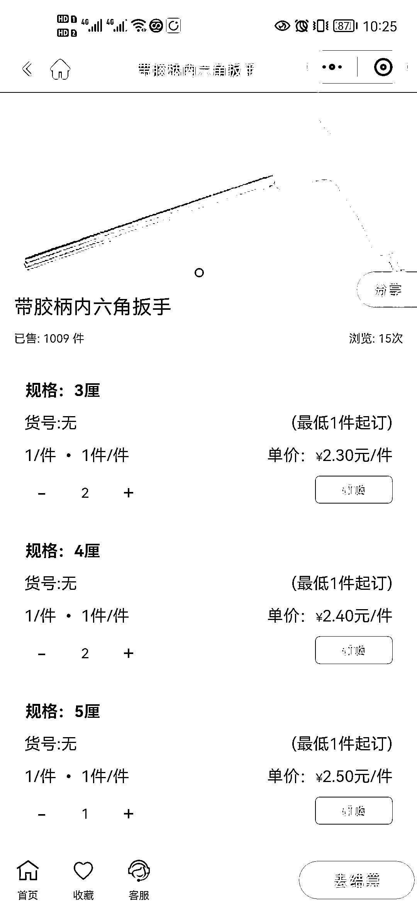
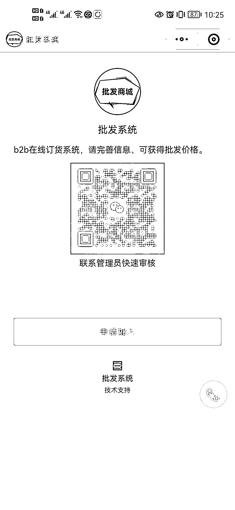
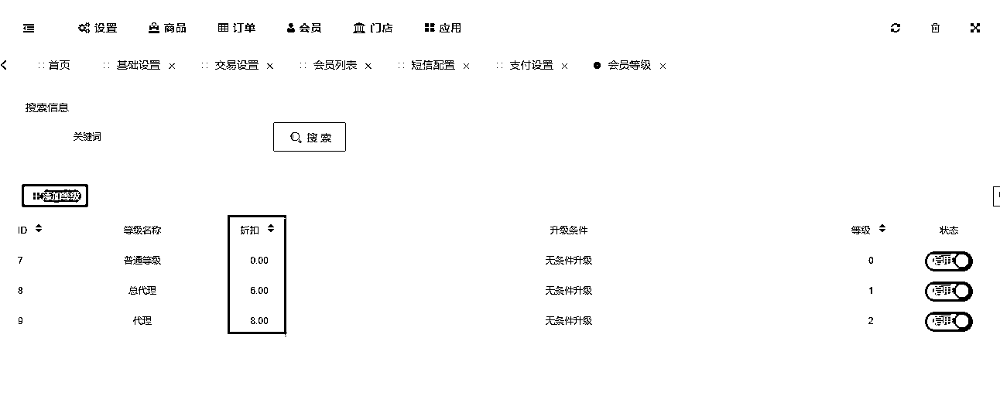

# 实体批发行业报价单变成订单，小程序变现 30 万+

> 原文：[`www.yuque.com/for_lazy/xkrm14/xme5gxm152yxtizq`](https://www.yuque.com/for_lazy/xkrm14/xme5gxm152yxtizq)

作者： 封伟-自动化变现

日期：2023-05-08

点赞数：40

正文：

实体批发行业报价单变成订单，小程序变现 30 万+ 5.1 跟朋友聊的，他们做日用品的一位经销商，开发批发小程序服务下游，解决对方报单不准确，报单效率低，产品信息沟通效率低等问题，为行业提供批发行业用的小程序，为不同客户设置不同价格，客户注册审核后才可见到价格，登录后可进行下单，后台进行发货核销 减少了繁琐的，核对订单，订单输入，新品知会等问题，三个月通过小程序系统变现了 30 万 图 1 为传统的报价，图 2 为批发小程序 每个批发行业都可复制，赋能同行，服务下游，商品，五金，食材，建材等

评论区：

