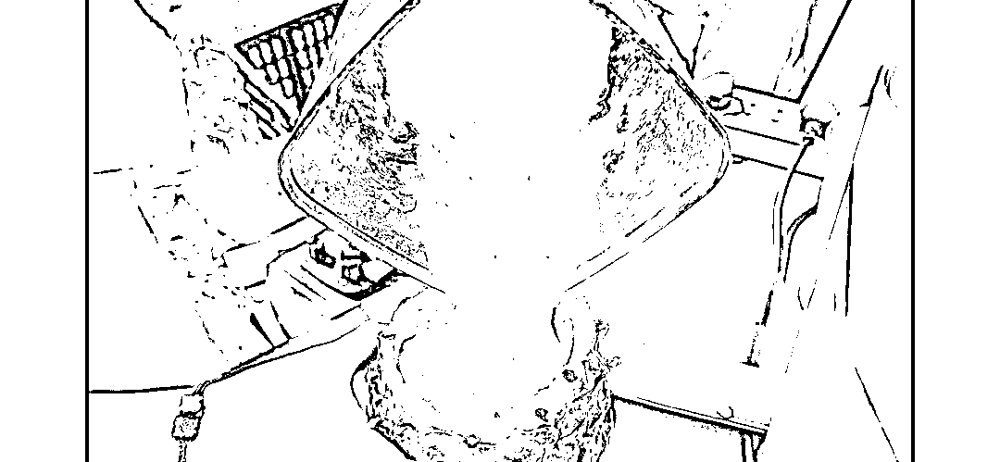
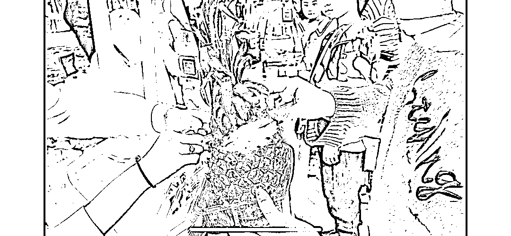

# 摆摊卖菠萝冰沙每天收入 2000+，有时间有摊位的小伙伴可以尝试

> 原文：[`www.yuque.com/for_lazy/xkrm14/ihzuw6yhkavv7fsw`](https://www.yuque.com/for_lazy/xkrm14/ihzuw6yhkavv7fsw)

作者： 不讲段子的段子手

日期：2023-05-05

点赞数：95

正文：

摆摊每天收入 2000+，有时间有摊位的小伙伴可以尝试，摆摊卖菠萝冰沙。 1.主打纯天然无色素饮料，家长觉得安心； 2.冰沙做好后放入空菠萝皮中，再盖上半个菠萝头，小朋友会觉得新奇好玩； 3.选一个好吃的菠萝品种，博主选的是海南金钻手撕菠萝。 提前把菠萝肉取出加水冷冻，拿到摊位现打现装，成本 5 元，卖 28 元。

  

  

评论区：

郁离居士 : 不错👍夏天也要来了 确实很适合

筱媛 : 很好的项目，可以尝试

星空 : 太强了

本自具足 : 厉害了

不讲段子的段子手 : 感谢亦仁大大🥰

Only : 想请教一下您 这个教程有吗

不讲段子的段子手 : 就是用工具把菠萝肉取出来，工具是那种直接取个环形的肉的那种，中间硬芯不取。取出来的菠萝肉加水冻起来，摆摊时候用榨汁机或者破壁机打成冰沙，倒进菠萝皮（菠萝皮+中间硬芯一体不分开）。菠萝头切两半，一半放在菠萝上装饰。再插根吸管就可以了。我看的那个博主再详细的也没有讲了，具体菠萝和水的比例可以先买菠萝和工具在家自己试验下。

