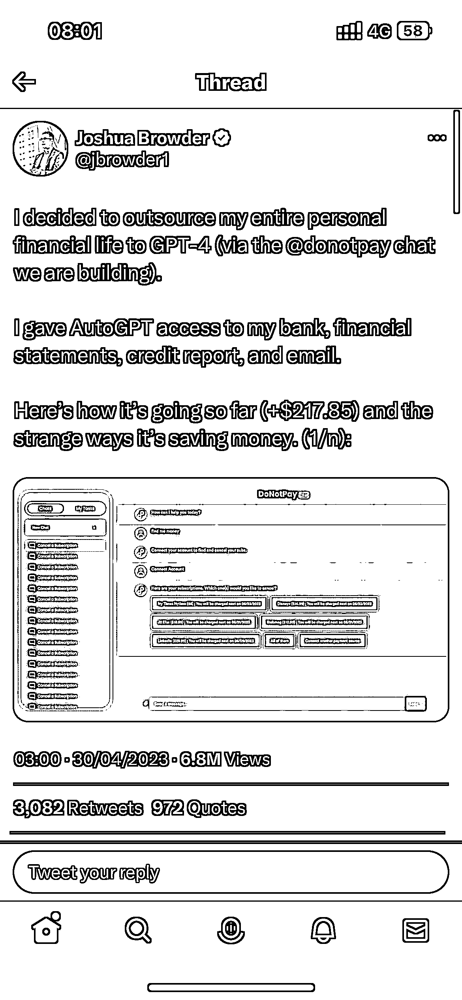

# 让 ChatGPT 当自己的理财专家

> 原文：[`www.yuque.com/for_lazy/xkrm14/fmw0q7lryq9mvg4v`](https://www.yuque.com/for_lazy/xkrm14/fmw0q7lryq9mvg4v)

作者： 蛤蟆先生

日期：2023-05-03

点赞数：43

正文：

这位老哥把自己的个人理财全部交给了 ChatGPT 来做，他给了 AutoGPT 自己的银行账户，email，以及一系列的财产报告的权限，让它当自己的理财专家。 目前的结果是赚了 217.85 美元， [https://twitter.com/jbrowder1/status/1652387444904...](https://twitter.com/jbrowder1/status/1652387444904583169?s=46&t=8dSRtokKcbqspjNpuvUMyw)

  

评论区：

Mia 米娅 : 好大胆

星火燎原 : 真会玩

