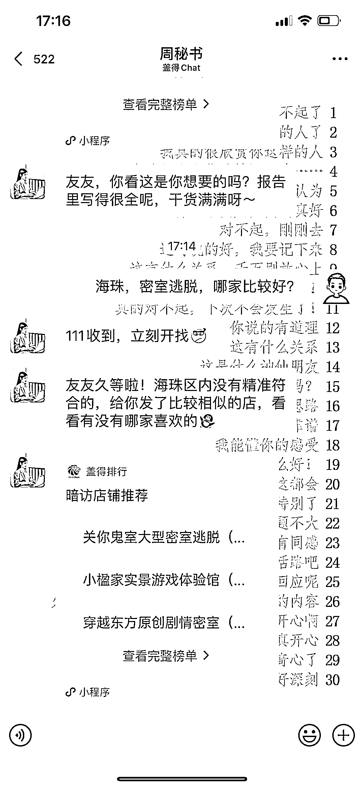
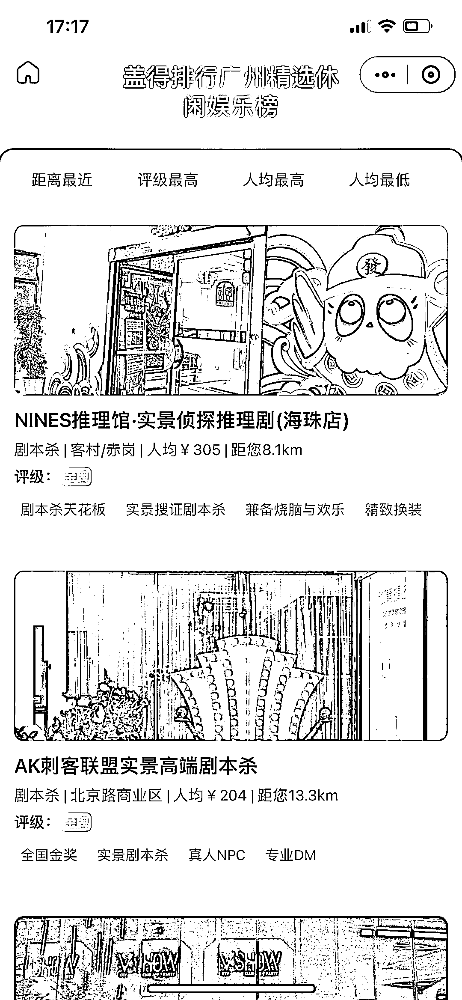

# 盖得排行推出 chat 助理，带你玩转本地吃喝玩乐

> 原文：[`www.yuque.com/for_lazy/xkrm14/yxb7vqogmho8lol8`](https://www.yuque.com/for_lazy/xkrm14/yxb7vqogmho8lol8)

作者： 九帆

日期：2023-04-30

点赞数：68

正文：

盖得排行推出 chat 助理，带你玩转本地吃喝玩乐，充当一个探店达人的形象。 吃喝玩乐分享，通常是公众号或者小程序，以及抖音，现在可以利用 chat 形式，与用户一对一服务，体验感会更好，增强信任感。

评论区：

野猫 : 财友您好，不小心点了个赞，赞后不看又觉得可惜。 看来看去，不是很懂，点开图片再看看，明了很多。 又想想，到底什么人这么牛，又认真仔细看了看；我靠，原来背后有一张聊天背景图；这下明白了，背景不重要，背景图才重要。说了这么多，你猜猜我想要什么吗？[呲牙]

福猫 : 聊天背景图可以分享一下吗？

小宝 : 这是企业微信吗？

KK : 不懂不懂，请问背景图怎么了？[呲牙][呲牙]

野猫 : 😇😇😇对背景图严重好奇。我想观摩一下

九帆 : 对的

九帆 : 它来了

九帆 : 发你了

